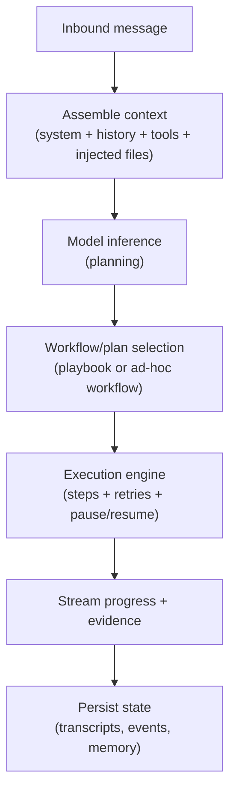

# Agent Loop

An agent loop is the end-to-end path from an inbound message to a final reply and/or actions. The gateway is responsible for keeping loop execution consistent and auditable.

## Loop stages

Workflow/plan selection may create or update WorkItems in the WorkBoard when the agent delegates long-running work while keeping the interactive session responsive (see [Work board and delegated execution](./workboard.md)).

## Serialization guarantee

- Runs are serialized per session key (and lane) to prevent tool and transcript races.
- This keeps session history consistent and makes replay/audit more reliable.

## Entry points

- Gateway RPC: `agent` and `agent.wait` (or equivalent HTTP endpoints)
- Channel ingress: a message mapped into a session enqueue
- Runtime behavior: each agent turn is enqueued as an execution-engine `Decide` step so turn side effects flow through the same durable control plane.
