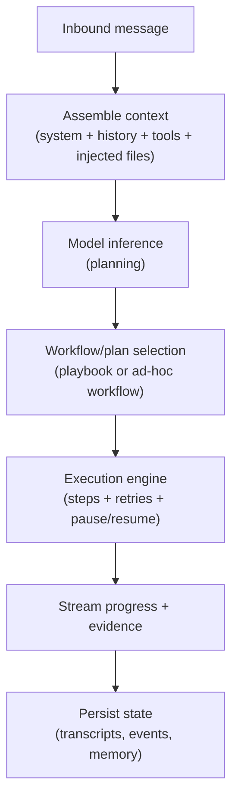

# Agent Loop

Status:

An agent loop is the end-to-end path from an inbound message to a final reply and/or actions. The gateway is responsible for keeping loop execution consistent and auditable.

## Loop stages (target)

## Serialization guarantee (target)

- Runs are serialized per session key (and lane) to prevent tool and transcript races.
- This keeps session history consistent and makes replay/audit more reliable.

## Entry points (conceptual)

- Gateway RPC: `agent` and `agent.wait` (or equivalent HTTP endpoints)
- Channel ingress: a message mapped into a session enqueue
