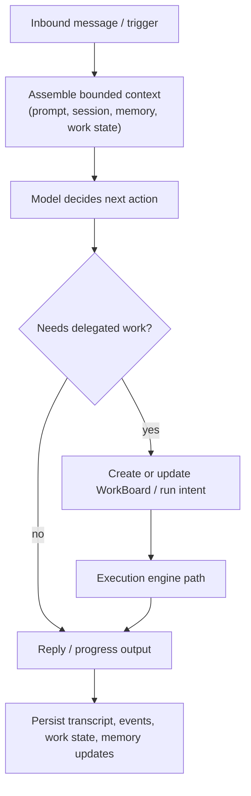

# Agent Loop

Read this if: you want the compact turn-by-turn control loop from inbound message to reply and durable state update.

Skip this if: you already know the turn loop and need detailed execution mechanics; use [Execution engine](/architecture/execution-engine).

Go deeper: [Messages and Sessions](/architecture/messages-sessions), [Work board and delegated execution](/architecture/workboard), [Memory](/architecture/memory).

## Turn loop

## Purpose

The agent loop is the runtime path that keeps a turn coherent and auditable. It combines context assembly, model decision-making, delegated execution, and durable state updates into one repeatable control loop instead of treating the model as the sole source of truth.

## What this page owns

- The high-level stages of one agent turn.
- The handoff from interactive decision-making into delegated work.
- The rule that turn outcomes become durable state, not just ephemeral output.

This page does not define protocol entry shapes or low-level run/lease mechanics.

## Key constraints

- Turn execution is serialized per session key and lane.
- Context is budgeted and assembled from durable state, not raw transcript replay alone.
- Side effects flow through delegated execution with approvals, idempotency, and evidence.
- Persisted state closes the loop so future turns can recover after interruption.

## Related docs

- [Agent](/architecture/agent)
- [Messages and Sessions](/architecture/messages-sessions)
- [Memory](/architecture/memory)
- [Work board and delegated execution](/architecture/workboard)
- [Execution engine](/architecture/execution-engine)
