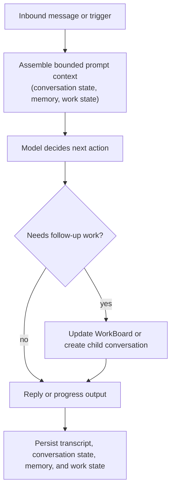

# Agent Loop

Read this if: you want the compact turn-by-turn control loop from inbound message to durable progress.

Skip this if: you already know the turn loop and need lower-level gateway coordination details; use [Turn Processing and Durable Coordination](/architecture/turn-processing).

Go deeper: [Messages and Conversations](/architecture/messages-conversations), [Work board and delegated execution](/architecture/workboard), [Memory](/architecture/memory).

## Turn loop

## Purpose

The agent loop keeps one turn coherent and auditable. It combines context assembly, model decision-making, side-effect gating, and durable state updates into one repeatable control loop instead of treating the model as the sole source of truth.

## What this page owns

- The high-level stages of one agent turn.
- The handoff from inline reasoning into WorkBoard updates or child-conversation delegation.
- The rule that turn outcomes become durable state, not just ephemeral output.

This page does not define protocol entry shapes or low-level gateway claim/lease mechanics.

## Key constraints

- Turn execution is serialized per conversation.
- Context is budgeted and assembled from durable state, not raw transcript replay alone.
- Side effects stay behind approvals, policy, and durable evidence.
- Persisted state closes the loop so future turns can recover after interruption or compaction.

## Related docs

- [Agent](/architecture/agent)
- [Messages and Conversations](/architecture/messages-conversations)
- [Conversations and Turns](/architecture/conversations-turns)
- [Memory](/architecture/memory)
- [Work board and delegated execution](/architecture/workboard)
- [Turn Processing and Durable Coordination](/architecture/turn-processing)
