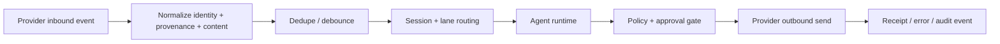

# Channels

Read this if: you want the connector boundary between Tyrum and external chat surfaces.

Skip this if: you need the core message/session model first; start with [Messages and Sessions](/architecture/messages-sessions).

Go deeper: [Markdown Formatting](/architecture/markdown-formatting), [Sessions and Lanes](/architecture/sessions-lanes), [Approvals](/architecture/approvals).

## Connector boundary

## Purpose

Channels let Tyrum receive messages from external chat systems and send replies back without leaking provider-specific quirks into the rest of the runtime. Connectors preserve identity, provenance, receipts, and policy semantics while projecting all traffic into one normalized messaging model.

## What this page owns

- Connector-level normalization of inbound provider events.
- Inbound dedupe and debounce before a message becomes durable session work.
- Outbound rendering, chunking, and receipt capture.
- The guarantee that sending to a channel remains a policy-gated side effect.

This page does not define protocol wire contracts or session serialization internals.

## Main flows

### Inbound

1. A provider event arrives from a DM, group, channel, or thread surface.
2. The connector normalizes sender/container identity, content, attachments, and provenance.
3. Dedupe and debounce prevent duplicate runs and reduce burst noise.
4. The normalized event enters the correct session and lane.

### Outbound

1. The runtime produces a reply or delivery action.
2. Policy and approvals decide whether the send is allowed.
3. The connector renders the message within provider caps, sends it with idempotency, and records receipts/errors as audit evidence.

## Key constraints

- Connectors are high-risk boundaries because outbound messages are real side effects.
- Inbound retries must not create duplicate work.
- Provenance must survive normalization so downstream policy can distinguish trusted from untrusted content.
- Connectors must not bypass approvals or sandbox rules by performing side effects outside the normal execution path.

## Related docs

- [Messages and Sessions](/architecture/messages-sessions)
- [Sessions and Lanes](/architecture/sessions-lanes)
- [Markdown Formatting](/architecture/markdown-formatting)
- [Approvals](/architecture/approvals)
