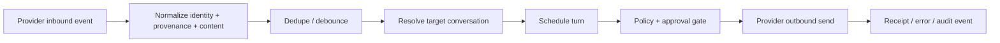

# Channels

Read this if: you want the connector boundary between Tyrum and external messaging systems.

Skip this if: you need the core message and conversation model first; start with [Messages and Conversations](/architecture/messages-conversations).

Go deeper: [Conversations and Turns](/architecture/conversations-turns), [Message flow control and delivery](/architecture/messages/flow-control-delivery), [Approvals](/architecture/approvals).

## Connector boundary

## Purpose

Channels let Tyrum receive messages from external chat systems and send replies back without leaking provider-specific quirks into the rest of the runtime. A channel is always an external integration concept. It is not the generic term for UI, automation, or delegation.

The broader ingress term is `surface`. Tyrum uses surfaces to talk about UI, channels, automation, delegation, and API-driven activity as one architectural category. A channel is one kind of surface, not the umbrella term.

## What this page owns

- Connector-level normalization of inbound provider events.
- Inbound dedupe and debounce before a message becomes conversation work.
- Outbound rendering, chunking, and receipt capture.
- The guarantee that sending to a channel remains a policy-gated side effect.

This page does not define protocol wire contracts or conversation serialization internals.

## Main flows

### Inbound

1. A provider event arrives from a DM, group, channel, or thread surface.
2. The connector normalizes sender/container identity, content, attachments, and provenance.
3. Dedupe and debounce prevent duplicate turns and reduce burst noise.
4. The normalized event resolves to the correct conversation and queues the next turn.

### Outbound

1. A turn produces a reply or delivery action.
2. Policy and approvals decide whether the send is allowed.
3. The connector renders the message within provider caps, sends it with idempotency, and records receipts/errors as audit evidence.

## Key constraints

- Channels are high-risk boundaries because outbound messages are real side effects.
- Inbound retries must not create duplicate turns.
- Provenance must survive normalization so downstream policy can distinguish trusted from untrusted content.
- Channels must not bypass approvals or sandbox rules by performing side effects outside the normal turn path.

## Related docs

- [Messages and Conversations](/architecture/messages-conversations)
- [Conversations and Turns](/architecture/conversations-turns)
- [Message flow control and delivery](/architecture/messages/flow-control-delivery)
- [ARCH-20 conversation and turn clean-break decision](/architecture/arch-20-conversation-turn-clean-break)
- [Markdown Formatting](/architecture/markdown-formatting)
- [Approvals](/architecture/approvals)
