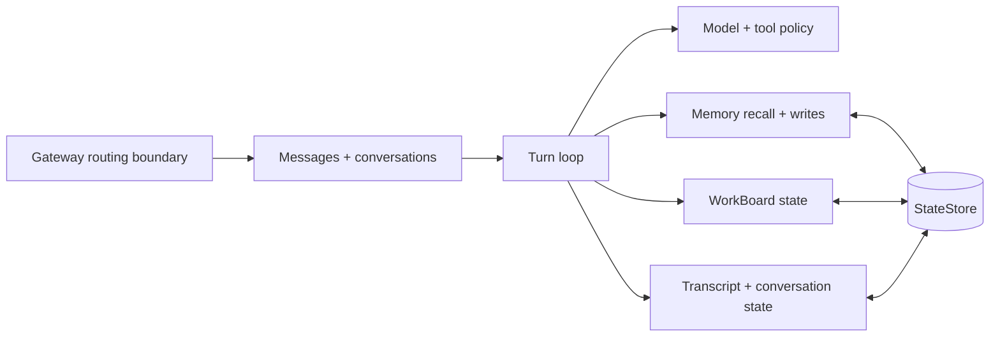

# Agent

An agent is Tyrum's durable runtime persona: one identity boundary that keeps conversations, memory, work state, and policy coherent across surfaces and turns.

## Read this page

- **Read this if:** you want the top-level mental model for how one Tyrum agent stays coherent over time.
- **Skip this if:** you already know the agent boundary and need mechanics details.
- **Go deeper:** use [Messages and Conversations](/architecture/messages-conversations), [Conversations and Turns](/architecture/conversations-turns), [Memory](/architecture/memory), [Work board and delegated execution](/architecture/workboard), and [ARCH-20 conversation and turn clean-break decision](/architecture/arch-20-conversation-turn-clean-break).

## Agent subsystem map

## Agent boundary

### What the agent owns

- Agent-scoped runtime configuration: identity, tone, tools, MCP, skills, memory policy, and prompt shaping.
- Durable continuity through conversations and conversation-scoped context assembly.
- Turn orchestration: prompt assembly, model calls, tool use, and durable follow-up decisions.
- Memory retrieval and writes that preserve long-term continuity across surfaces.
- WorkBoard updates that keep background commitments explicit instead of relying on transcript recall.

### What the agent does not own

- Transport, protocol validation, and edge connectivity ownership.
- Human approval policy or authz policy authoring.
- Node-local execution internals or provider-specific channel behavior.

## Primary flows

### Interactive turn flow

1. A surface event is routed to the agent through a conversation.
2. The runtime assembles prompt context from conversation state, memory, and active work state.
3. The turn produces progress, durable state updates, and any needed follow-up turns or child conversations.

### Background progress flow

1. Work or automation targets the same agent through a dedicated conversation.
2. The agent continues making progress through durable turns under the same conversation and state model.
3. Outcomes are reflected back into transcript, conversation state, memory, and WorkBoard.

## Invariants for this boundary

- Agent continuity is scoped by `agent_id`.
- Memory is agent-scoped and survives conversation boundaries.
- Conversation context is partitioned by `conversation_id`, not by implicit hidden sub-contexts.
- Turns are serialized per conversation so one context boundary has one active line of reasoning at a time.
- Durable state, not transcript replay alone, is the recovery source of truth.

## Go deeper

- [Architecture](/architecture)
- [Messages and Conversations](/architecture/messages-conversations)
- [Conversations and Turns](/architecture/conversations-turns)
- [Transcript, Conversation State, and Prompt Context](/architecture/transcript-conversation-state)
- [Channels](/architecture/channels)
- [Memory](/architecture/memory)
- [Context, Compaction, and Pruning](/architecture/context-compaction)
- [Work board and delegated execution](/architecture/workboard)
- [ARCH-20 conversation and turn clean-break decision](/architecture/arch-20-conversation-turn-clean-break)
- [System Prompt](/architecture/system-prompt)
- [Multi-Agent Routing](/architecture/multi-agent-routing)
- [Agent Loop](/architecture/agent-loop)
