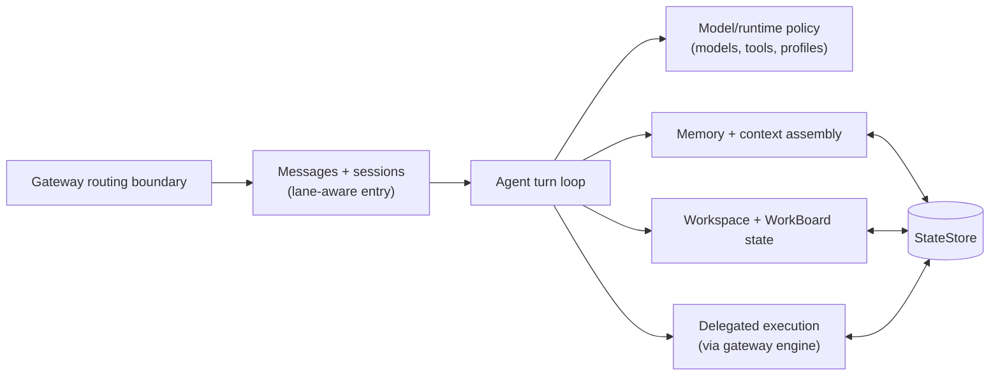

# Agent

An agent is Tyrum's durable runtime persona: one boundary that keeps conversations, memory, workspace context, and active commitments coherent across turns and channels.

## Read this page

- **Read this if:** you want the top-level mental model for how one Tyrum agent stays coherent over time.
- **Skip this if:** you already know agent boundaries and need low-level mechanics.
- **Go deeper:** use the links at the end for message flow, memory mechanics, work-state mechanics, and runtime loop details.

## Agent subsystem map

## Agent boundary

### What the agent owns

- Agent-scoped runtime configuration: models, tools, skills, execution profile, and prompt shaping policy.
- Durable conversational continuity through sessions, lane-aware message handling, and context assembly.
- Workspace-facing and work-management context through WorkBoard and related state.
- Memory retrieval and writes that preserve long-term continuity across channels.

### What the agent does not own

- Transport, protocol validation, and edge connectivity ownership.
- Cross-system execution coordination semantics (retries, leasing, approval pipelines).
- Device-specific capability execution on nodes.

## Primary flows

### Interactive turn flow

1. A normalized request enters the agent through messages and sessions.
2. The runtime assembles bounded context from session state, memory, and active work state.
3. The turn produces a reply, updates durable state, and may create delegated background work.

### Delegated work flow

1. The agent captures or updates work intent in WorkBoard state.
2. Side-effecting execution is delegated to gateway-managed execution paths under policy controls.
3. Execution outcomes are reflected back into memory and work state for future turns.

## Invariants for this boundary

- Agent continuity is scoped by `agent_id`.
- Durable state, not transcript continuity alone, is the source of truth across interruptions.
- Agent runtime stays inside the gateway policy envelope and does not bypass approvals or secret boundaries.
- Interactive turns remain responsive even when long-running work continues in the background.

## Go deeper

- [Architecture](/architecture)
- [Workspace](/architecture/workspace)
- [Models](/architecture/models)
- [Channels](/architecture/channels)
- [Messages and Sessions](/architecture/messages-sessions)
- [Sessions and Lanes](/architecture/sessions-lanes)
- [Memory](/architecture/memory)
- [Context, Compaction, and Pruning](/architecture/context-compaction)
- [Work board and delegated execution](/architecture/workboard)
- [System Prompt](/architecture/system-prompt)
- [Multi-Agent Routing](/architecture/multi-agent-routing)
- [Agent Loop](/architecture/agent-loop)
