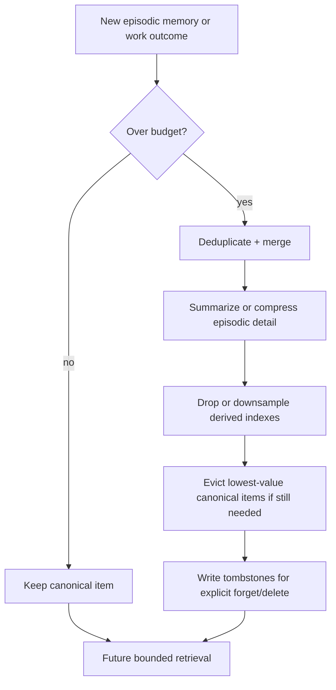

# Memory consolidation and retention

Read this if: you need the exact budget, consolidation, and forgetting rules behind agent memory.

Skip this if: you only need the high-level memory boundary; start with [Memory](/architecture/memory).

Go deeper: [Context, Compaction, and Pruning](/architecture/context-compaction), [Work board and delegated execution](/architecture/workboard).

This is a mechanics page for how Tyrum keeps durable memory bounded and auditable over time. It covers consolidation, budgets, forgetting, and tombstones rather than the purpose of memory itself.

## Consolidation loop

## What this page covers

- budget-driven consolidation
- preferred eviction order
- explicit forgetting and tombstones
- the interaction between conversation compaction and durable memory writes

## Pre-compaction flush

When a conversation is close to auto-compaction, Tyrum may trigger a silent turn that reminds the agent to write durable memory before older prompt context is summarized away. The intended outcome is often "record memory, send no user-visible reply."

## Budgets and enforcement

Forgetting is budget-driven, not TTL-driven.

Budgets may be expressed as:

- maximum bytes or characters of note text
- maximum item count by kind
- maximum embedding or vector footprint
- maximum episodic detail retained before summaries replace raw payloads

Timestamps may be used as tie-breakers, but not as TTL-based deletion triggers.

## Recommended consolidation order

When over budget, apply the least-destructive steps first:

1. deduplicate and merge
2. summarize or compress high-volume episodic material
3. drop or downsample derived indexes
4. evict low-utility canonical items while preserving tombstones

Compression is preferred over deletion, and WorkBoard outcomes may be promoted into durable memory when they become reusable facts or procedures.

## Forgetting and tombstones

Tyrum supports explicit forgetting by stable id or by selectors such as kind, key, tag, or provenance.

For auditability, forgetting produces tombstones:

- tombstones preserve stable ids and minimal metadata
- tombstones support deletion proof and compliance workflows
- tombstones remain bounded, but should survive long enough to meet audit policy

## Safety and operator control

- secrets must never be persisted into memory
- memory administration remains provider-defined and policy-gated
- retrieval must not bypass approvals or policy decisions
- all memory operations should remain observable through events and audit logs

## Related docs

- [Memory](/architecture/memory)
- [Context, Compaction, and Pruning](/architecture/context-compaction)
- [Work board and delegated execution](/architecture/workboard)
