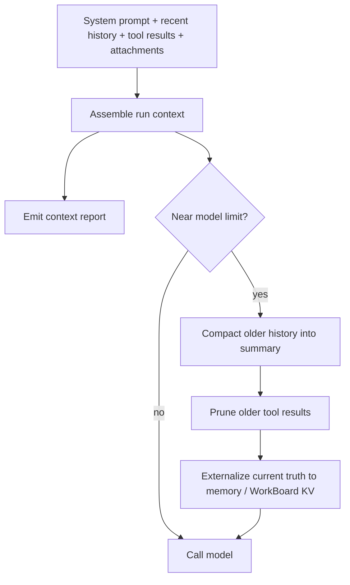

# Context, Compaction, and Pruning

Read this if: you need the mechanics for how Tyrum keeps prompt context within model limits without losing current truth.

Skip this if: you only need the higher-level memory or session model; start with [Memory](/architecture/memory) or [Messages and Sessions](/architecture/messages-sessions).

Go deeper: [Memory consolidation and retention](/architecture/memory/consolidation-retention), [Work board and delegated execution](/architecture/workboard), [Observability](/architecture/observability).

This is a mechanics page for prompt context assembly, compaction, and tool-result pruning. The context for a run is bounded by the model's context window, so long-running sessions need deterministic trimming that preserves safety-critical information.

## Context budget loop

## Context stack

Typical layers:

- System prompt (rules, tools, skills, runtime, injected files)
- Conversation history (user + assistant messages)
- Tool calls/results and attachments (command output, files, images/audio)

Tool schemas (contracts) are also part of what the model receives and therefore count toward the context window even though they are not plain-text history.

## Context reports

For observability, the gateway produces a per-run context report that captures:

- injected workspace files (raw vs injected sizes)
- system prompt section sizes
- largest tool schema contributors
- recent-history and tool-result contributions

Operator clients expose the report via `/context list` and `/context detail` (see [Observability](/architecture/observability)).

## Compaction

When the session approaches the context limit, older history is compacted into a summary that preserves safety and task-relevant facts.

Compaction should:

- Keep approvals, constraints, and user preferences intact.
- Preserve key decisions and unfinished threads.
- Avoid inventing facts or deleting obligations.

## Compaction vs durable memory

Session compaction is a **prompt-level** optimization; it is not a long-term memory system.

- The compaction summary exists to keep ongoing work safe and coherent within a bounded context window.
- Long-term memory lives in the StateStore (agent-scoped) and is retrieved as a budgeted digest for each turn (see [Memory](/architecture/memory)).
- Active work state lives in the StateStore via the WorkBoard (workspace-scoped) and is retrieved as a budgeted Work focus digest for each turn (see [Work board and delegated execution](/architecture/workboard)).

At compaction boundaries, the system MAY trigger consolidation workflows that promote durable lessons (facts/preferences/procedures) out of ephemeral context into long-term memory. These workflows are budget-driven and auditable, and must not silently “remember” sensitive content.

To reduce reliance on prompt history, important "current truth" should be externalized to durable state:

- Key decisions belong in WorkBoard DecisionRecords.
- Current plan variables and pinned constraints belong in canonical state KV (agent/work item).

## Pruning

Pruning reduces context bloat by trimming or clearing older tool results in the prompt for a single run while leaving the durable transcript intact.

Pruning:

- applies only to tool-result messages (never to user or assistant turns)
- is deterministic and policy-controlled
- is designed to improve cost and cache behavior for providers that support prompt caching

## Runtime policy

The gateway applies deterministic pruning/compaction between tool-loop steps during an agent turn:

- Tool call/results are pruned before each step, keeping only the most recent tool interactions.
- Total messages sent per step are capped (system + instruction head is preserved).

Configuration:

- The number of trailing tool interactions retained per step is configurable and enforced deterministically.
- The total number of messages sent per step is configurable and enforced deterministically.

## Related docs

- [Memory](/architecture/memory)
- [Memory consolidation and retention](/architecture/memory/consolidation-retention)
- [Work board and delegated execution](/architecture/workboard)
- [Observability](/architecture/observability)
