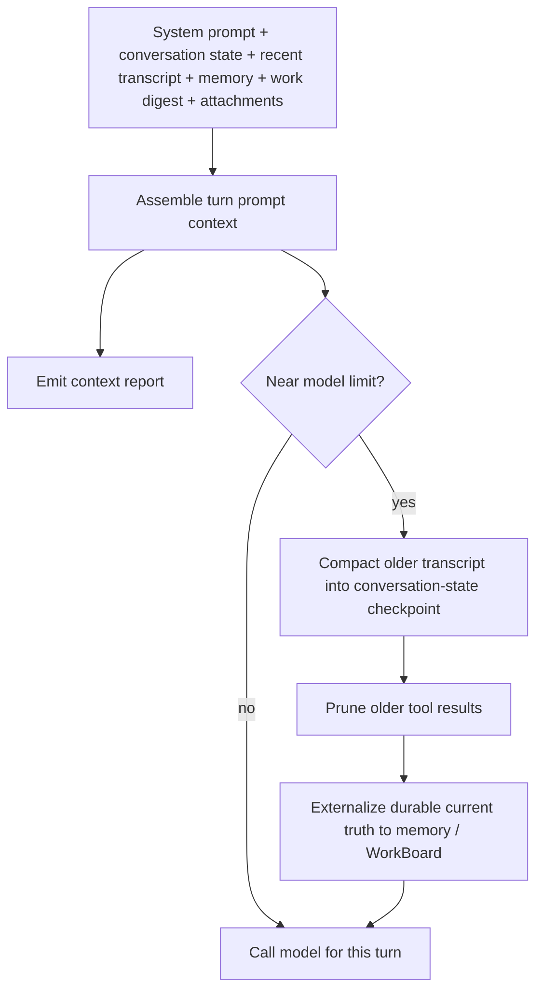

# Context, Compaction, and Pruning

Read this if: you need the mechanics for how Tyrum keeps prompt context within model limits without losing current truth.

Skip this if: you only need the higher-level memory or conversation model; start with [Memory](/architecture/memory) or [Messages and Conversations](/architecture/messages-conversations).

Go deeper: [Transcript, Conversation State, and Prompt Context](/architecture/transcript-conversation-state), [Work board and delegated execution](/architecture/workboard), [Observability](/architecture/observability).

This is a mechanics page for prompt-context assembly, transcript compaction, and tool-result pruning. The context for one turn is bounded by the model's context window, so long-lived conversations need deterministic trimming that preserves safety-critical information.

## Context budget loop

## Context stack

Typical layers:

- System prompt and runtime instructions
- Conversation state checkpoint and pending state
- Recent transcript tail
- Memory recall
- WorkBoard digest
- Current turn input, tool results, and attachments

Tool schemas are also part of what the model receives and count toward the context window even though they are not plain-text history.

## Context reports

For observability, the gateway produces a per-turn context report that captures:

- injected workspace files (raw vs injected sizes)
- system prompt section sizes
- largest tool schema contributors
- recent-history and tool-result contributions

Operator clients expose the report via `/context list` and `/context detail` (see [Observability](/architecture/observability)).

## Compaction

When a conversation approaches the context limit, older transcript history is compacted into conversation state that preserves safety and task-relevant facts.

Compaction should:

- keep approvals, constraints, and user preferences intact
- preserve key decisions and unfinished threads
- avoid inventing facts or deleting obligations

## Compaction vs durable memory

Conversation compaction is a **prompt-level** optimization. It is not a long-term memory system.

- The compaction checkpoint exists to keep ongoing work safe and coherent within a bounded context window.
- Long-term memory lives in the StateStore and is retrieved as a budgeted digest for each turn (see [Memory](/architecture/memory)).
- Active work state lives in the StateStore via the WorkBoard and is retrieved as a budgeted work digest for each turn (see [Work board and delegated execution](/architecture/workboard)).

At compaction boundaries, the system MAY trigger consolidation workflows that promote durable lessons out of ephemeral conversation state into long-term memory. These workflows are budget-driven and auditable, and must not silently remember sensitive content.

To reduce reliance on prompt history, important current truth should be externalized to durable state:

- key decisions belong in WorkBoard DecisionRecords
- stable facts and preferences belong in memory or explicit state KV
- pending operational state belongs in conversation state

## Pruning

Pruning reduces context bloat by trimming or clearing older tool results in the prompt for a single turn while leaving the durable transcript intact.

Pruning:

- applies only to tool-result content in prompt context
- is deterministic and policy-controlled
- is designed to improve cost and cache behavior for providers that support prompt caching

## Runtime policy

The gateway applies deterministic pruning and compaction between tool-loop steps during a turn:

- tool call/results are pruned before each step, keeping only the most recent tool interactions
- total prompt messages per step are capped while preserving the system head and current-turn context

## Related docs

- [Messages and Conversations](/architecture/messages-conversations)
- [Transcript, Conversation State, and Prompt Context](/architecture/transcript-conversation-state)
- [Memory](/architecture/memory)
- [Work board and delegated execution](/architecture/workboard)
- [Observability](/architecture/observability)
