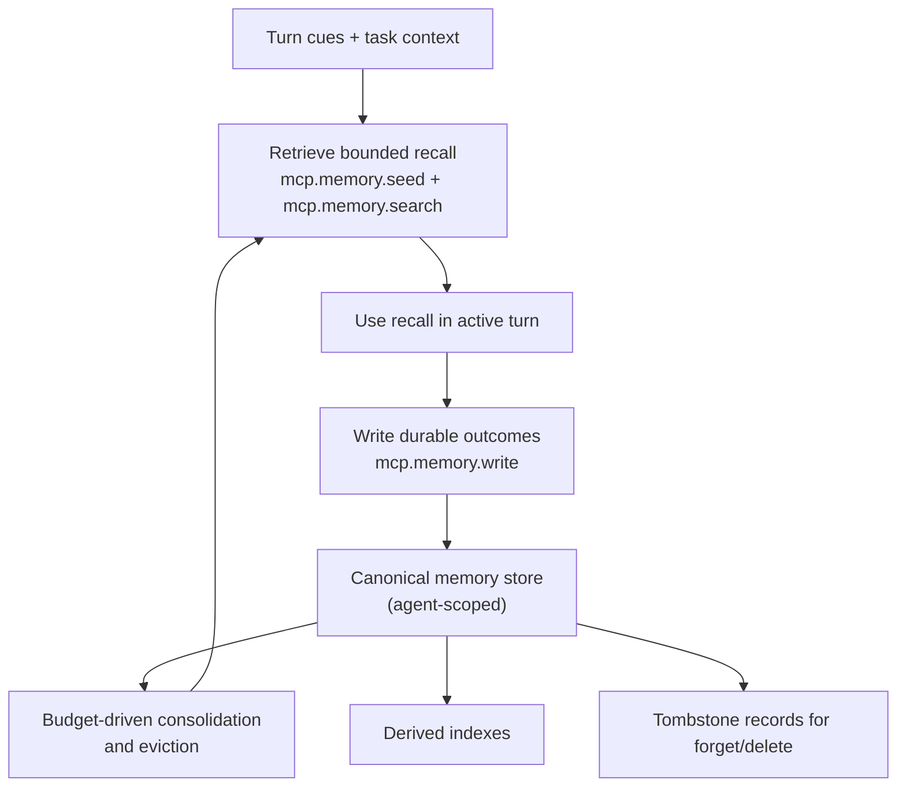

# Memory

Read this if: you want to understand how Tyrum keeps durable agent knowledge coherent across turns.

Skip this if: you are looking for transcript behavior; use [Messages and Conversations](/architecture/messages-conversations).

Go deeper: [Memory consolidation and retention](/architecture/memory/consolidation-retention), [Context, Compaction, and Pruning](/architecture/context-compaction).

## Core flow

## Purpose

Memory is Tyrum's durable, agent-scoped knowledge layer. It converts useful outcomes from turns and background work into recallable context so the runtime does not depend on replaying full transcripts.

## MCP-native capability boundary

Memory is an **MCP-native capability**, not a gateway-owned CRUD surface. The runtime interacts through stable tools:

- `mcp.memory.seed` for pre-turn hydration.
- `mcp.memory.search` for bounded recall during a turn.
- `mcp.memory.write` for durable facts, notes, procedures, and episodic updates.

Memory configuration is carried in `server_settings.memory`. Retrieval hooks are wired through `pre_turn_tools` so recall can be assembled before inference starts.

Pre-turn hydration and memory-role semantics should be declared through MCP tool metadata overrides so built-in and third-party memory providers follow the same runtime contract. Schema-based inference remains only as a compatibility fallback for MCP tools that do not declare those overrides.

## Main flow

1. A turn begins with retrieval cues from conversation state, work state, and operator intent.
2. The configured memory provider returns bounded, attributed recall suitable for prompt assembly.
3. During or after execution, the runtime writes durable memory when information should survive the current turn.
4. Consolidation enforces memory budgets by summarizing, merging, or pruning lower-value content while preserving canonical records.

## What this page owns

- Agent-scoped durable memory items and provenance.
- Bounded retrieval behavior and pre-turn seeding.
- Budget-driven consolidation and eviction rules.
- Auditable delete/forget behavior through tombstone records.

This page does not own transcript storage, secret handling, or active work tracking.

## Key constraints

- Memory is partitioned by `agent_id`.
- Retrieval is supportive context, not policy authority.
- Budgets, not inactivity TTL, drive forgetting behavior.
- Canonical content is the source of truth; indexes are derived and rebuildable.
- Secrets must not be written to memory.

## Failure and recovery

Expected failures include provider outages, stale indexes, and temporary over-budget states. Recovery favors best-effort recall, durable canonical storage, and deferred consolidation rather than blocking the entire agent turn.

## Related docs

- [Agent](/architecture/agent)
- [Work board and delegated execution](/architecture/workboard)
- [Context, Compaction, and Pruning](/architecture/context-compaction)
- [Memory consolidation and retention](/architecture/memory/consolidation-retention)
