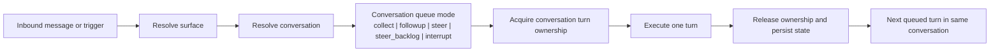

# Conversations and Turns

Read this if: you need exact conversation identity, turn serialization, or queue-mode behavior.

Skip this if: you want only the high-level message model; start with [Messages and Conversations](/architecture/messages-conversations).

Go deeper: see [Message flow control and delivery](/architecture/messages/flow-control-delivery) for transport and backpressure behavior, and [ARCH-20 conversation and turn clean-break decision](/architecture/arch-20-conversation-turn-clean-break) for the long-lived vocabulary decision.

## Parent concept

- [Messages and Conversations](/architecture/messages-conversations)

## Scope

This page defines the durable mechanics behind Tyrum's conversation model: what a conversation is, how turns are serialized, how queue modes behave, and when a child conversation should exist instead of overloading one context boundary.

## Conversation serialization model

## Conversations

- A conversation is the durable context boundary for one agent on one surface.
- Each UI thread gets its own conversation.
- Each direct message, group chat, and channel thread gets its own conversation according to provider identity and configured isolation rules.
- Heartbeat uses one dedicated conversation per `(agent, workspace)` so every heartbeat is a new turn in the same continuity stream.
- Delegation may create a child conversation when background work needs context isolation from the parent conversation.

## Surface-driven conversation kinds

Tyrum resolves conversations from a surface plus durable routing identity. Typical kinds are:

- `ui_thread`
- `direct_message`
- `group_thread`
- `channel_thread`
- `heartbeat`
- `automation`
- `delegation`

The gateway chooses the durable `conversation_id`. Provider thread ids, peer ids, or watcher ids are routing inputs, not the conversation identity itself.

## Turns

A turn is one durable episode of agent reasoning and progress inside one conversation.

Typical lifecycle:

- `queued`
- `active`
- `waiting_approval`
- `waiting_external`
- `completed`
- `failed`
- `cancelled`

The top-level architecture stops here. There is no separate first-class activity stream above turns.

## Child conversations for isolation

When Tyrum needs isolation, it creates a separate conversation instead of overloading one context boundary with multiple competing concerns. Use a child conversation when:

- background work would pollute the parent transcript
- separate serialization is required
- a narrower scope or execution profile is needed
- a delegated workflow needs its own compacted continuity state

## Queue modes

When a conversation already has an active turn, inbound input is handled by an explicit queue mode:

- **`collect` (default):** coalesce queued input into one follow-up turn after the active turn ends.
- **`followup`:** preserve each inbound input as its own follow-up turn.
- **`steer`:** inject new input at the next safe boundary of the active turn.
- **`steer_backlog`:** steer now and also preserve the input for a later follow-up turn.
- **`interrupt`:** stop the active turn at the next safe boundary and prefer the newest input.

## Hard invariants

- Exactly one conversation owns one continuity stream.
- At most one turn is active in a conversation at a time.
- Compaction does not end or replace the conversation. It only changes conversation state.
- Heartbeat is a dedicated conversation, not a hidden substream inside a user thread.
- Child conversations are explicit and durable so operators can inspect why context was isolated.

## Related docs

- [Messages and Conversations](/architecture/messages-conversations)
- [Transcript, Conversation State, and Prompt Context](/architecture/transcript-conversation-state)
- [Message flow control and delivery](/architecture/messages/flow-control-delivery)
- [ARCH-20 conversation and turn clean-break decision](/architecture/arch-20-conversation-turn-clean-break)
