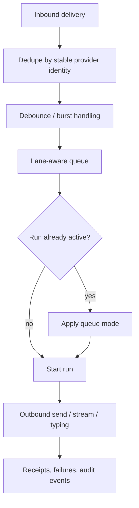

# Message flow control and delivery

Read this if: you need the operational rules for dedupe, debounce, queueing, streaming, and outbound delivery after a message enters a session.

Skip this if: you only need the high-level message/session model; start with [Messages and Sessions](/architecture/messages-sessions).

Go deeper: [Sessions and Lanes](/architecture/sessions-lanes), [Markdown Formatting](/architecture/markdown-formatting), [Channels](/architecture/channels).

This is a mechanics page for conversational flow after a message has entered a session: dedupe, debounce, queueing, loop control, outbound delivery, typing, and formatting.

## Delivery pipeline

## Inbound controls

Channels can redeliver the same inbound message after reconnects and retries. Tyrum prevents duplicate runs by deduping inbound deliveries before they enqueue work.

Dedupe is typically keyed by stable identifiers such as:

- `(channel, account_id, container_id, message_id)`

Entries are durable and time-bounded so dedupe remains correct under clustered gateway edges.

## Debounce and burst handling

Rapid consecutive messages from the same sender/container are batched into a single agent turn using a per-container debounce window:

- text-only bursts can be coalesced
- attachments flush immediately
- explicit control commands bypass debouncing

## Queueing while a run is active

When a run is already active for a `(session_key, lane)`, Tyrum uses explicit queue modes:

- `collect`
- `followup`
- `steer`
- `steer_backlog`
- `interrupt`

Queueing is durable, lane-aware, and bounded by caps and overflow policy.

## Loop control

Tyrum uses multiple layers of loop control:

- per-turn step budgets
- within-turn loop detection on repeated tool signatures
- cross-turn repetition warnings
- bounded session retention that is separate from execution limits

## Outbound delivery

Outbound messages to channels are side effects:

- each send carries an idempotency key
- risky sends remain approval-gated
- provider receipts and failures are captured as audit events and, when useful, as artifacts

Operator clients receive the same state through typed event streams rather than connector-style message delivery.

## Typing, streaming, and formatting

Tyrum supports responsiveness features without weakening determinism:

- block streaming for long replies
- typing indicators with explicit start modes and bounded cadence
- small pacing delays when a connector needs less bursty delivery

Markdown is chunked before connector-specific rendering so formatting does not break across delivery boundaries. See [Markdown Formatting](/architecture/markdown-formatting).

## Constraints and edge cases

- queueing behavior must survive retries and restarts
- `steer` and `interrupt` only apply at safe execution boundaries
- non-interactive lanes should not emit typing by default
- channel formatting caps must not silently truncate semantically important content without an observable fallback

## Related docs

- [Messages and Sessions](/architecture/messages-sessions)
- [Sessions and Lanes](/architecture/sessions-lanes)
- [Channels](/architecture/channels)
- [Markdown Formatting](/architecture/markdown-formatting)
