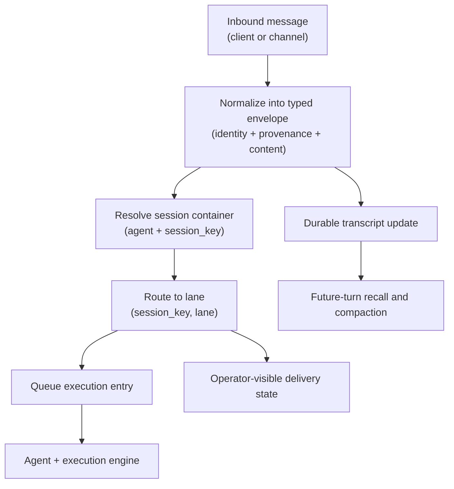

# Messages and Sessions

Read this if: you need to understand how inbound chat becomes durable agent work.

Skip this if: you are debugging wire-level contracts; use [Protocol](/architecture/protocol) instead.

Go deeper: [Sessions and Lanes](/architecture/sessions-lanes), [Message flow control and delivery](/architecture/messages/flow-control-delivery), [Markdown Formatting](/architecture/markdown-formatting).

## Core flow

## Purpose

Messages and sessions are the entry boundary between conversational input and durable execution. This layer gives Tyrum one stable message model across clients and channels, then maps that input into the correct session and lane so follow-up behavior remains coherent under retries, reconnects, and compaction.

## What this page owns

- Message normalization into a typed envelope with provenance.
- Session targeting and lane entry (`(session_key, lane)`).
- Durable transcript authority and retention hooks.
- Queue entry into downstream execution.

This page does not define protocol wire shapes and does not define execution internals. It defines how conversation enters those systems.

## Main flow

1. A client or channel message is normalized into Tyrum's envelope, including sender, container identity, content, attachments, and provenance tags.
2. The runtime resolves the agent and session container, then computes the execution lane.
3. The message enters the lane queue, which is serialized per `(session_key, lane)` to keep turn behavior deterministic.
4. Transcript and delivery state are persisted, so operator views and later turns use durable state rather than ephemeral socket state.

## Key constraints

- Session transcript state is durable and remains the source of truth for future turns.
- Lane serialization is mandatory for predictable ordering inside one session lane.
- Inbound dedupe and retry-safety are required because connectors and clients can replay messages.
- Provenance must be preserved so downstream policy can treat trusted and untrusted content differently.
- Outbound sends remain side effects and stay under policy and approval controls.

## Failure and recovery

Common failures include duplicate inbound delivery, temporary queue pressure, and reconnect churn. Recovery relies on durable dedupe keys, lane-aware queueing, and transcript-backed rehydration instead of in-memory chat state.

## Related docs

- [Agent](/architecture/agent)
- [Channels](/architecture/channels)
- [Sessions and Lanes](/architecture/sessions-lanes)
- [Message flow control and delivery](/architecture/messages/flow-control-delivery)
- [Markdown Formatting](/architecture/markdown-formatting)
