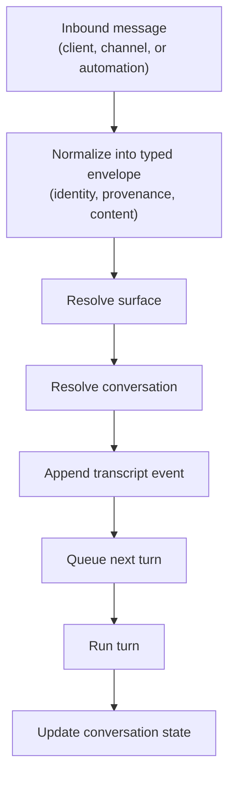

# Messages and Conversations

Read this if: you need to understand how inbound input becomes durable agent work.

Skip this if: you are debugging wire-level contracts; use [Protocol](/architecture/protocol) instead.

Go deeper: [Conversations and Turns](/architecture/conversations-turns), [Transcript, Conversation State, and Prompt Context](/architecture/transcript-conversation-state), [Message flow control and delivery](/architecture/messages/flow-control-delivery), [ARCH-20 conversation and turn clean-break decision](/architecture/arch-20-conversation-turn-clean-break).

## Core flow

## Purpose

Messages and conversations are the entry boundary between inbound input and durable agent continuity. This layer gives Tyrum one stable message model across surfaces, maps that input into the correct conversation, and makes later turns recoverable under compaction, reconnects, and approvals.

## What this page owns

- Message normalization into a typed envelope with provenance.
- Surface targeting and conversation resolution.
- Durable transcript updates and conversation-state continuity.
- Queue entry into downstream turn processing.

This page does not define protocol wire shapes and does not define prompt-assembly internals. It defines how conversation enters those systems.

## Main flow

1. A client, channel, or automation signal is normalized into Tyrum's message envelope.
2. The gateway resolves the surface and the target conversation.
3. The transcript is updated durably before later recovery depends on the new input.
4. The next turn is queued for that conversation, and conversation state becomes the continuity layer for future turns.

## Key constraints

- Transcript is durable retained history, not the direct prompt context.
- Conversation state is the mutable continuity layer for current truth across compactions.
- Turn serialization is enforced per conversation.
- Inbound dedupe and retry-safety are required because connectors and clients can replay messages.
- Provenance must be preserved so downstream policy can treat trusted and untrusted content differently.

## Failure and recovery

Common failures include duplicate inbound delivery, temporary queue pressure, and reconnect churn. Recovery relies on durable dedupe keys, conversation-backed rehydration, and conversation-state checkpoints instead of in-memory chat state.

## Related docs

- [Agent](/architecture/agent)
- [Channels](/architecture/channels)
- [Conversations and Turns](/architecture/conversations-turns)
- [Transcript, Conversation State, and Prompt Context](/architecture/transcript-conversation-state)
- [Message flow control and delivery](/architecture/messages/flow-control-delivery)
- [ARCH-20 conversation and turn clean-break decision](/architecture/arch-20-conversation-turn-clean-break)
- [Markdown Formatting](/architecture/markdown-formatting)
