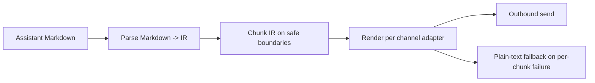

# Markdown Formatting

Read this if: you need the exact formatting pipeline from model Markdown to channel-safe outbound content.

Skip this if: you only need the message/session architecture; start with [Messages and Sessions](/architecture/messages-sessions).

Go deeper: [Message flow control and delivery](/architecture/messages/flow-control-delivery), [Channels](/architecture/channels).

Tyrum formats assistant output by converting Markdown into a neutral intermediate representation (IR) before chunking and rendering. This keeps formatting deterministic across channels with different markup rules.

## Formatting pipeline

## What this page guarantees

- **Consistency:** one parse step, many channel renderers.
- **Safe chunking:** split before rendering so inline formatting and code fences stay valid.
- **Channel fit:** map the same IR to Slack/Telegram/Discord/etc. without re-parsing.
- **Security:** escape/encode channel markup correctly and avoid link/HTML injection.

## IR pipeline

1. **Parse Markdown → IR**
   - IR is plain text plus structured spans:
     - styles: bold/italic/strike/inline-code/spoiler (where supported)
     - links: `{start,end,href}`
     - blocks: paragraphs, lists, blockquotes, code blocks/fences
   - Parsing is deterministic and does not execute embedded HTML/JS.

2. **Chunk IR (format-first)**
   - Chunking happens on the IR text, not on channel markup.
   - Rules:
     - never split inside inline styles
     - never split inside fenced code blocks; when forced, close + reopen the fence
     - prefer chunk breaks at paragraph boundaries, then newlines, then whitespace
   - Chunk sizes are clamped by each channel’s text limits.

3. **Render per channel**
   - Each channel adapter renders from IR into the channel’s native format:
     - Slack: mrkdwn tokens + safe link rendering
     - Telegram: HTML parse mode with strict escaping
     - Discord: Markdown with length/line caps
     - WhatsApp/Signal/iMessage: conservative formatting subset

## Table policy

Markdown tables are normalized using a channel policy:

- `code`: render as a fenced code block (portable default)
- `bullets`: convert rows into bullet points (mobile-friendly)
- `off`: pass through as plain text

## Link policy

Links are rendered with channel-safe rules:

- preserve label vs href when the channel supports it
- when the channel cannot represent labeled links, render as `label (url)`
- normalize and validate URL schemes; disallowed schemes are rendered as plain text

## Fallbacks

If parsing or rendering fails for a chunk:

- fall back to plain text for that chunk
- emit an event indicating a formatting fallback occurred

The system emits a durable episodic event (`event_type=channel_formatting_fallback`) so operators can inspect fallbacks in operator surfaces.

This keeps delivery robust under channel-specific formatting quirks without losing the underlying content.

## Interaction with streaming

Block streaming uses the same IR chunker. This guarantees that streamed partial replies and final replies share identical chunk boundaries and formatting rules.

## Related docs

- [Messages and Sessions](/architecture/messages-sessions)
- [Message flow control and delivery](/architecture/messages/flow-control-delivery)
- [Channels](/architecture/channels)
