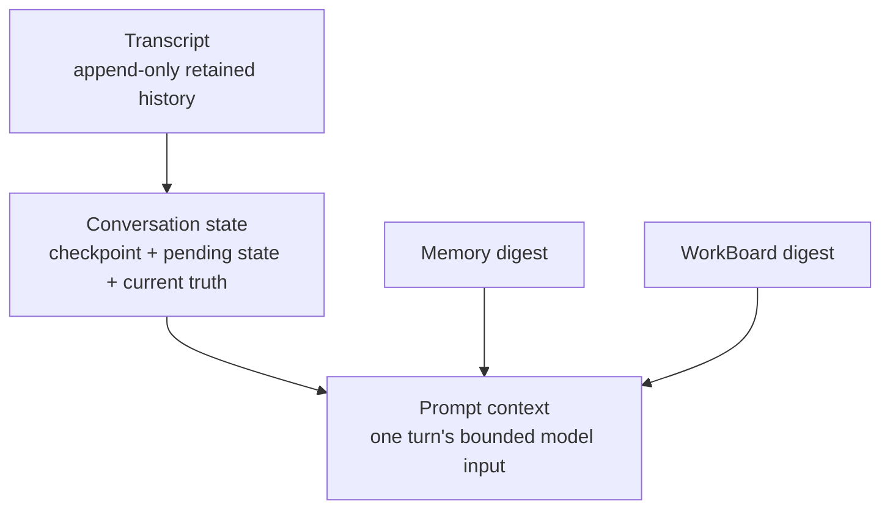

# Transcript, Conversation State, and Prompt Context

Read this if: you need the exact continuity model for long-lived conversations under compaction.

Skip this if: you only need the high-level conversation model; start with [Messages and Conversations](/architecture/messages-conversations).

Go deeper: [Context, Compaction, and Pruning](/architecture/context-compaction), [Memory](/architecture/memory), [Work board and delegated execution](/architecture/workboard), and [ARCH-20 conversation and turn clean-break decision](/architecture/arch-20-conversation-turn-clean-break).

## Parent concepts

- [Messages and Conversations](/architecture/messages-conversations)
- [Conversations and Turns](/architecture/conversations-turns)

## Scope

This page defines the three durable layers that are often confused with one another: transcript, conversation state, and prompt context. Tyrum keeps them separate so one conversation can survive many compactions without losing current truth.

## Continuity stack

## Transcript

Transcript is the retained event history for one conversation.

- It is append-only.
- It exists for audit, replay, troubleshooting, and operator inspection.
- It may contain many more events than the model can ever see in one prompt.
- It must survive compaction because compaction is not deletion of history.

## Conversation state

Conversation state is the mutable continuity layer for one conversation.

It should capture the smallest durable set of facts needed to continue safely across turns, such as:

- compaction checkpoint or handoff summary
- recent event cursor
- pending approvals
- pending external or tool activity
- pinned current-truth values that should not drift under transcript compaction

Conversation state is not long-term memory and not a second transcript. It is the continuity projection of the conversation.

## Prompt context

Prompt context is the bounded model input for one turn.

It is assembled from:

- system prompt and runtime instructions
- conversation state
- the recent transcript tail
- memory recall
- WorkBoard digest
- current turn input and attachments

Prompt context is ephemeral. It can change on every turn without changing the underlying transcript or conversation identity.

## Why this separation matters

- One conversation can survive many compactions because transcript is retained while conversation state carries forward current truth.
- The model does not need the full transcript to continue safely.
- Memory and WorkBoard stay outside the conversation transcript, so long-term knowledge and work status do not depend on prompt replay.

## Compaction rule

Compaction transforms older transcript history into a tighter conversation-state checkpoint plus a recent transcript tail. It does not create a new conversation and does not replace transcript retention policy.

## Related docs

- [Conversations and Turns](/architecture/conversations-turns)
- [Context, Compaction, and Pruning](/architecture/context-compaction)
- [Memory](/architecture/memory)
- [Work board and delegated execution](/architecture/workboard)
- [ARCH-20 conversation and turn clean-break decision](/architecture/arch-20-conversation-turn-clean-break)
