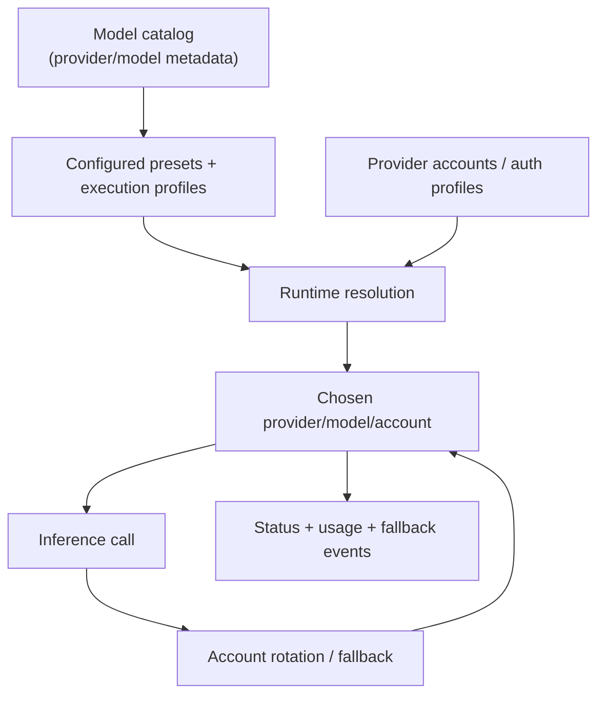

# Models

Read this if: you want the architecture of model selection, presets, and fallback inside one agent.

Skip this if: you need provider auth or secret-resolution detail first; use [Provider Auth and Onboarding](/architecture/auth) and [Secrets](/architecture/secrets).

Go deeper: [Observability](/architecture/observability), [Agent](/architecture/agent), [System Prompt](/architecture/system-prompt).

## Selection model

## Purpose

This boundary turns operator configuration into a predictable runtime model choice. It lets Tyrum choose a concrete `provider/model`, account, and fallback path without burying that logic inside prompt text or connector-specific code.

## What this page owns

- The model catalog and the `provider/model` identifier scheme.
- Presets, execution-profile assignments, and agent primary/fallback model selection.
- Provider-account rotation and model fallback behavior.
- Observability around what model/account was chosen and why.

This page does not define provider onboarding or raw secret storage.

## Main resolution flow

1. Tyrum loads model metadata from the shared catalog, using lease-controlled refresh and durable caching.
2. Runtime selection resolves the active candidate in order: conversation preset override, conversation raw model override, execution-profile preset assignment, agent primary model, then fallback chain.
3. Within the chosen provider, Tyrum selects or rotates a configured account deterministically.
4. If the call fails, recovery first rotates provider accounts, then moves through the explicit model fallback chain.

## Key constraints

- Runtime resolution fails closed when no configured candidate exists; Tyrum does not silently invent a default model.
- Model selection is deterministic and observable, especially under fallback.
- Provider accounts are backed by auth profiles and secret handles, not inline credentials.
- Catalog refresh must be safe under multi-replica deployment.

## Related docs

- [Agent](/architecture/agent)
- [System Prompt](/architecture/system-prompt)
- [Provider Auth and Onboarding](/architecture/auth)
- [Secrets](/architecture/secrets)
- [Observability](/architecture/observability)
