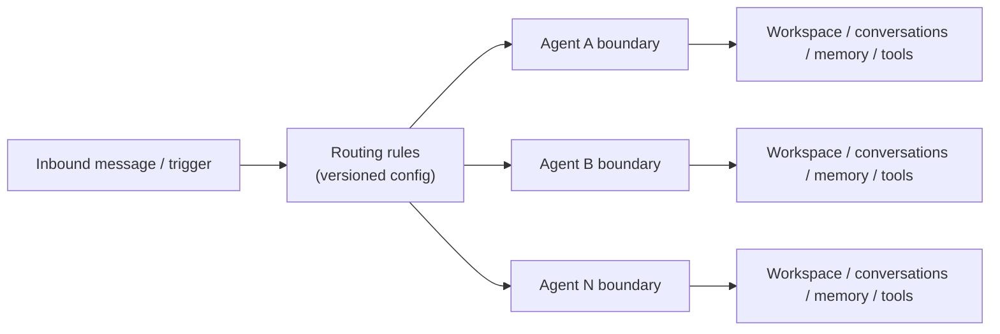

# Multi-Agent Routing

Read this if: you want the boundary that decides which agent owns an inbound message or trigger.

Skip this if: you only need single-agent behavior; the main [Agent](/architecture/agent) overview is enough.

Go deeper: [Conversations and Turns](/architecture/conversations-turns), [Gateway](/architecture/gateway), [Node](/architecture/node).

## Routing boundary

## Purpose

Multi-agent routing lets one gateway host multiple isolated agents while keeping inbound routing explicit and auditable. The important property is not many agents, but that each agent keeps its own workspace, conversations, memory, tools, and secrets unless a policy explicitly allows otherwise.

## What this page owns

- The routing-rule boundary between inbound events and agent selection.
- The isolation model for per-agent state.
- The idea that routing is durable, auditable configuration rather than hidden connector logic.

This page does not define the exact admin API schema or low-level conversation identity details.

## Main flow

1. An inbound message or trigger arrives with channel/account/container identity.
2. The gateway evaluates the effective routing rules.
3. The selected agent becomes the owner of the conversation/workspace/memory scope for that interaction.
4. Rule changes are written as versioned config revisions and exposed through operator APIs and audit events.

## Key constraints

- Cross-agent access is deny-by-default.
- Routing decisions must be reversible and auditable.
- Conversation identity conventions must remain stable when routing rules evolve.
- Stronger isolation modes can move agents into separate processes or containers without changing the logical routing model.

## Related docs

- [Agent](/architecture/agent)
- [Conversations and Turns](/architecture/conversations-turns)
- [Gateway](/architecture/gateway)
- [Channels](/architecture/channels)
