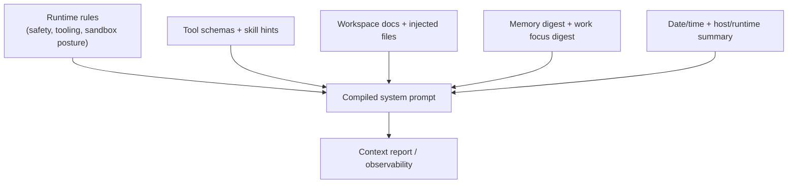

# System Prompt

Read this if: you want the architecture boundary for how Tyrum assembles model-facing runtime context.

Skip this if: you are looking for prompt-writing tips; this page is about system design, not prompt craft.

Go deeper: [Models](/architecture/models), [Memory](/architecture/memory), [Work board and delegated execution](/architecture/workboard).

## Assembly boundary

## Purpose

The system prompt boundary exists so Tyrum can turn runtime state into a bounded, inspectable model input. It keeps prompt assembly explicit and observable instead of letting critical safety or workspace assumptions live in hidden application code.

## What this page owns

- The sections that contribute to the model-facing system prompt.
- The distinction between advisory prompt context and hard runtime enforcement.
- Context-report observability for what was injected and how large it was.

This page does not define prompt wording policy for every provider or replace policy/approval enforcement.

## Assembly model

Common sections include:

- tool and skill availability
- workspace and injected bootstrap files
- memory and work-state digests
- sandbox/runtime posture
- date/time and other runtime summary data

The gateway also emits a per-run context report describing section sizes, injected files, and the largest schema contributors so operators can inspect what the model actually saw.

## Key constraints

- The prompt should carry the minimum context needed for safe, effective execution.
- Guardrails in the prompt are advisory; policy, approvals, validation, and sandboxing enforce.
- Memory and work-state enter as budgeted digests, not as unconstrained raw history.
- Injected workspace files should reduce tool calls, not become an unbounded secondary transcript.

## Related docs

- [Agent](/architecture/agent)
- [Models](/architecture/models)
- [Memory](/architecture/memory)
- [Work board and delegated execution](/architecture/workboard)
- [Observability](/architecture/observability)
