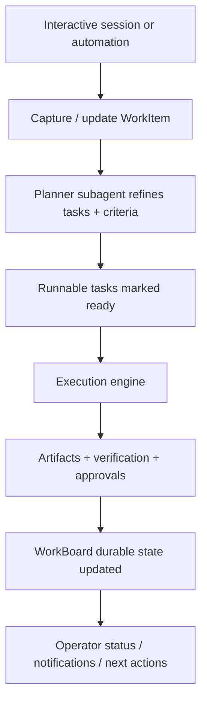

# WorkBoard delegated execution

Read this if: you need the handoff model between interactive work capture and background execution.

Skip this if: you are looking for run/step retry semantics; use [Execution engine](/architecture/execution-engine).

Go deeper: [WorkBoard durable work state](/architecture/workboard/durable-work-state), [Approvals](/architecture/approvals), [Sessions and Lanes](/architecture/sessions-lanes).

This page describes how the WorkBoard captures long-running work, delegates it into background execution, and routes status and completion back to the operator. It does not redefine execution-engine step semantics.

## Delegation flow

The model decides when to externalize work. Background services decide when `ready` work is actually claimed and executed.

## Standard intake flow

1. Classify the request as inline, Action WorkItem, or Initiative WorkItem.
2. Write minimal acceptance criteria, budgets, and authoritative current-truth state.
3. Seed the WorkItem with initial work artifacts, risks, or reminders.
4. Let a planner subagent refine, decompose, and prepare the item for automatic dispatch.

## Delegated execution model

A subagent is a delegated execution context that shares the parent agent's identity boundary but has its own runtime context and session key.

Starting semantics:

- Same `agent_id`, same workspace, same policy bundle, and same memory scope.
- Different `session_key`, so it does not serialize behind a channel-facing session.
- Subagent runs normally execute in `lane=subagent`.
- An execution profile chooses model, tool allowlist, and whether the subagent is read-only or write-capable.

The WorkBoard is updated from durable execution outcomes plus explicitly written WorkBoard records, not from chat narrative alone.

## Fan-out and synthesis

"Figure out what to do" can be expressed as explicit fan-out tasks followed by a synthesis task that proposes next steps.

To keep planning inspectable and resilient under interruption:

- fan-out tasks produce WorkArtifacts such as hypotheses, candidate plans, ToolIntent, and verification reports
- synthesis writes a DecisionRecord, updates the WorkItem task graph and state KV, and may create WorkSignals
- when inputs conflict, the planner inserts an explicit read-only "jury" fan-out before side effects proceed

## Status and notification routing

The interactive agent loop should answer progress questions using WorkBoard state:

- `work.status(last_active_work_id)` or `work.list_active()` for current status
- blockers, approvals, recent DecisionRecords, and next-step summaries from durable work state

Completion or blocked-state notifications should route to the last active session or client session, with `created_from_session_key` as a fallback.

## Backlog and WIP control

Multiple long-running WorkItems are expected. The WorkBoard prevents overload and thrash through:

- WIP limits on `Doing` work
- overlap detection on target resources
- explicit dependency links instead of implicit work merging
- budgeted drill-down retention for artifacts, decisions, and signals

## Safety integration

Delegation does not bypass Tyrum's enforcement model:

- side effects still flow through the execution engine
- approvals still pause work safely
- verification and evidence remain required where feasible
- ToolIntent and intent checks pause and escalate instead of allowing "helpful drift"

## Related docs

- [Work board and delegated execution](/architecture/workboard)
- [Execution engine](/architecture/execution-engine)
- [Approvals](/architecture/approvals)
- [Sessions and Lanes](/architecture/sessions-lanes)
- [WorkBoard durable work state](/architecture/workboard/durable-work-state)
