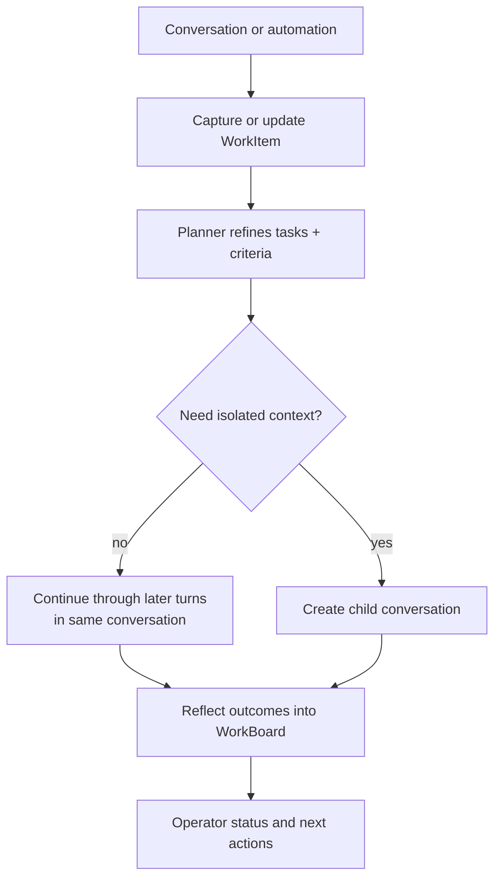

# WorkBoard delegation and child conversations

Read this if: you need the handoff model between interactive work capture and background progress.

Skip this if: you only need the high-level WorkBoard boundary; use [Work board and delegated execution](/architecture/workboard).

Go deeper: [WorkBoard durable work state](/architecture/workboard/durable-work-state), [Approvals](/architecture/approvals), [Conversations and Turns](/architecture/conversations-turns).

This page describes how WorkBoard captures long-lived work, chooses when to continue in the same conversation versus a child conversation, and routes progress back to the operator. It does not define a second top-level execution model.

## Delegation flow

## Standard intake flow

1. Classify the request as inline work, action work, or initiative work.
2. Write minimal acceptance criteria, budgets, and authoritative current-truth state.
3. Seed the WorkItem with initial artifacts, risks, or reminders.
4. Decide whether follow-up work stays in the same conversation or moves into a child conversation.

## Child conversation model

A child conversation is a delegated context that shares the parent agent boundary but has its own conversation state and transcript.

Starting semantics:

- same `agent_id`
- same workspace and policy envelope
- shared memory scope unless a narrower memory policy is explicitly chosen
- different `conversation_id`, so it does not serialize behind the parent conversation
- explicit parent/child linkage so operators can inspect why isolation exists

The WorkBoard is updated from durable conversation outcomes plus explicitly written WorkBoard records, not from transcript narrative alone.

## Fan-out and synthesis

Figure out what to do can still be expressed as explicit fan-out tasks followed by a synthesis task that proposes next steps.

To keep planning inspectable and resilient under interruption:

- fan-out tasks produce WorkArtifacts such as hypotheses, candidate plans, and verification reports
- synthesis writes a DecisionRecord, updates the WorkItem task graph and state KV, and may create WorkSignals
- when inputs conflict, the planner inserts an explicit read-only child conversation before side effects proceed

## Status and notification routing

The interactive agent loop should answer progress questions using WorkBoard state:

- `work.status(last_active_work_id)` or `work.list_active()` for current status
- blockers, approvals, recent DecisionRecords, and next-step summaries from durable work state

Completion or blocked-state notifications should route to the originating conversation, with child-conversation linkage preserved for drill-down.

## Backlog and WIP control

Multiple long-lived WorkItems are expected. The WorkBoard prevents overload and thrash through:

- WIP limits on active work
- overlap detection on target resources
- explicit dependency links instead of implicit work merging
- budgeted drill-down retention for artifacts, decisions, and signals

## Safety integration

Delegation does not bypass Tyrum's enforcement model:

- side effects still flow through the same turn-processing and approval rules
- approvals still pause progress safely
- verification and evidence remain required where feasible
- drift checks pause and escalate instead of allowing helpful but unsafe improvisation

## Related docs

- [Work board and delegated execution](/architecture/workboard)
- [Approvals](/architecture/approvals)
- [Conversations and Turns](/architecture/conversations-turns)
- [WorkBoard durable work state](/architecture/workboard/durable-work-state)
