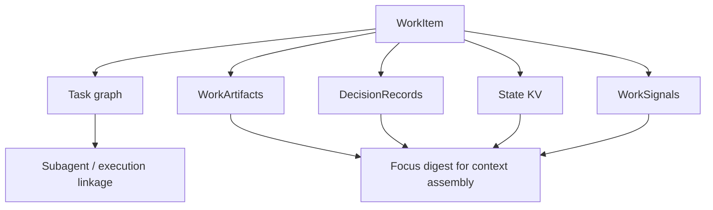

# WorkBoard durable work state

Read this if: you need the exact durable records that make WorkBoard state inspectable, resumable, and compact.

Skip this if: you only need the high-level WorkBoard boundary; start with [Work board and delegated execution](/architecture/workboard).

Go deeper: [WorkBoard delegated execution](/architecture/workboard/delegated-execution), [Execution engine](/architecture/execution-engine), [Artifacts](/architecture/artifacts).

This is a mechanics page for the durable records behind a WorkItem. It covers the drill-down state that makes WorkBoard inspectable, resumable, and compact enough to survive long-running work.

## Durable state map

## Core durable records

### WorkArtifact

A WorkArtifact is a typed, durable record attached to a WorkItem or workspace that captures intermediate planning or execution state.

Common kinds:

- `candidate_plan`
- `hypothesis`
- `risk`
- `tool_intent`
- `verification_report`
- `jury_opinion`
- `result_summary`

WorkArtifacts are not transcripts. They should point at durable identifiers rather than duplicate large raw logs.

### DecisionRecord

A DecisionRecord captures:

- the question being decided
- the chosen option
- considered alternatives
- rationale and supporting inputs
- who or what made the decision

DecisionRecords are the durable answer to "what changed and why?" during long-running work.

### WorkSignal

A WorkSignal externalizes "remember to do X later" as state instead of hoping transcript recall will hold it.

Typical trigger modes:

- time-based triggers
- event-based triggers such as approval resolution or artifact arrival

### State KV and focus digest

Some state is rendered as authoritative key/value state because language models can drift on latest-value facts under interference.

Examples:

- agent-level pinned constraints or preferences
- WorkItem-level current-truth values such as selected branch, environment, deadline, or chosen approach

During context assembly, Tyrum derives a budgeted focus digest from the WorkBoard and current-truth KV so the runtime sees the active working set without replaying large histories.

## Task graph mechanics

Each WorkItem may own a task graph whose nodes represent tasks and whose edges represent dependencies.

Core rules:

- the planner creates and updates the graph over time
- a coordinator leases runnable tasks to the correct execution profile
- a task is runnable only when its dependencies are terminal
- WorkItem state is derived from aggregate task state plus approvals and evidence

Task dependencies are currently stored on each task row as `depends_on_json` so the model stays cross-database and migration-friendly.

## Data model sketch

The durable entities behind the WorkBoard are:

- `WorkItem`
- `WorkItemTask`
- `WorkItemEvent`
- `WorkArtifact`
- `DecisionRecord`
- `WorkSignal`
- `StateKV`
- `Subagent`

Exact schemas remain part of versioned contracts and storage docs.

## Observability

WorkBoard and subagent activity should emit events such as:

- `work.item.created`
- `work.item.updated`
- `work.item.blocked`
- `work.item.completed`
- `work.task.started`
- `work.task.completed`
- `work.artifact.created`
- `work.decision.created`
- `work.signal.fired`
- `subagent.spawned`

Each event should point back to durable identifiers so clients can rehydrate after reconnect.

## Constraints and edge cases

- Drill-down data is budgeted and may be summarized over time to keep the board usable.
- Overlap detection warns about conflicting work, but it should not auto-merge unrelated items.
- Durable work state improves explainability, but it is not a substitute for execution evidence or approvals.

## Related docs

- [Work board and delegated execution](/architecture/workboard)
- [WorkBoard delegated execution](/architecture/workboard/delegated-execution)
- [Execution engine](/architecture/execution-engine)
- [Artifacts](/architecture/artifacts)
