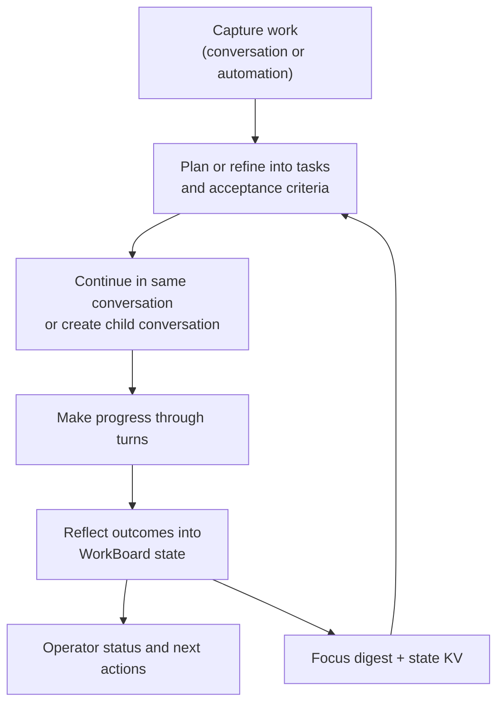

# Work board and delegated execution

Read this if: you need to understand how Tyrum tracks long-lived work outside one conversation transcript.

Skip this if: you only need the high-level agent loop; start with [Agent](/architecture/agent).

Go deeper: [WorkBoard delegation and child conversations](/architecture/workboard/delegated-execution), [WorkBoard durable work state](/architecture/workboard/durable-work-state), [Turn Processing and Durable Coordination](/architecture/turn-processing).

## Core flow

## Purpose

WorkBoard is Tyrum's durable work-management surface. It keeps commitments, blockers, and progress explicit so conversations can stay coherent while background work continues across many turns and compactions.

## What this page owns

- WorkItems with lifecycle state, acceptance criteria, and blockers.
- Task-level work state and readiness for future turns.
- Durable planning and evidence context such as WorkArtifacts, DecisionRecords, and WorkSignals.
- Operator-facing status derived from durable state rather than transcript reconstruction.

This page does not own transport, channel behavior, or long-term memory.

## Main flow

1. Work is captured from a conversation or automation trigger into a WorkItem.
2. Planning or refinement updates tasks, criteria, and current truth.
3. Progress happens through future turns in the same conversation or in child conversations when isolation is needed.
4. WorkBoard reflects those outcomes into durable state that operators and later turns can query directly.

## Key constraints

- WorkBoard state is durable and survives reconnects, compaction, and restarts.
- Interactive UX must remain responsive even while long-lived work continues through later turns.
- Work state cannot bypass policy, approvals, or evidence requirements.
- Status answers should come from WorkBoard records, not transcript memory.

## Failure and recovery

Common failures are blocked tasks, stale plans, conflicting branches, or abandoned work. Recovery depends on explicit blockers, durable state, and follow-up turns that resume from WorkBoard truth instead of hoping the model remembers old transcript details.

## Why this boundary exists

- Durable work state prevents fragile in-chat commitments.
- Child conversations isolate noisy background work when needed without overloading one conversation boundary.
- Typed drill-down records preserve explainability without turning the transcript into a project log.

## Operator-facing outcome

Operators get a compact status surface for what is blocked, what is in progress, and what is done while still being able to drill into evidence, decisions, and approvals when needed.

## Related docs

- [Agent](/architecture/agent)
- [Messages and Conversations](/architecture/messages-conversations)
- [Conversations and Turns](/architecture/conversations-turns)
- [WorkBoard delegation and child conversations](/architecture/workboard/delegated-execution)
- [WorkBoard durable work state](/architecture/workboard/durable-work-state)
