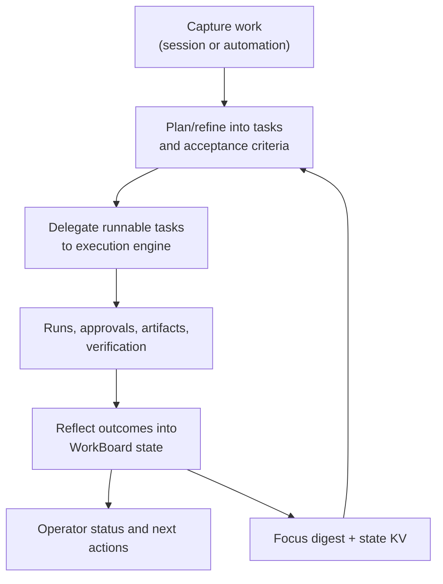

# Work board and delegated execution

Read this if: you need to understand how Tyrum tracks long-running work outside the chat transcript.

Skip this if: you are debugging step retries, leases, or run-state internals; use [Execution engine](/architecture/execution-engine).

Go deeper: [WorkBoard delegated execution](/architecture/workboard/delegated-execution), [WorkBoard durable work state](/architecture/workboard/durable-work-state).

## Core flow

## Purpose

WorkBoard is Tyrum's durable work-management surface. It keeps commitments, blockers, and progress explicit so interactive turns can stay responsive while background work continues safely.

## What this page owns

- WorkItems with lifecycle state, acceptance criteria, and blockers.
- Task-level work state and readiness for delegated execution.
- Durable planning and evidence context such as WorkArtifacts, DecisionRecords, and WorkSignals.
- Operator-facing status derived from durable state rather than transcript reconstruction.

This page does not own transport, step execution, approval enforcement, or raw artifact byte storage.

## Main flow

1. Work is captured from a session or automation trigger into a WorkItem.
2. Planning/refinement creates task structure and marks runnable work.
3. The execution engine performs delegated work and returns outcomes, approvals, and evidence.
4. WorkBoard reflects those outcomes into durable state that operators and future turns can query directly.

## Key constraints

- WorkBoard state is durable and survives reconnects, compaction, and restarts.
- Interactive UX must remain responsive even while background work is active.
- Work state cannot bypass policy, approvals, idempotency, or evidence requirements.
- Status answers should come from WorkBoard records, not transcript memory.

## Failure and recovery

Common failures are blocked tasks, stale plans, conflicting branches, or abandoned work. Recovery depends on explicit blockers, durable state, and reconciliation paths that let work pause and resume without losing intent history.

## Why this boundary exists

- Durable work state prevents fragile “remembered in-chat” commitments.
- Delegation isolates long-running operations from interactive latency.
- Typed drill-down records preserve explainability without turning the chat thread into a project log.

## Operator-facing outcome

Operators get a compact status surface for "what is blocked, what is running, and what is done" while still being able to drill into evidence, decisions, and approvals when needed.

## Related docs

- [Agent](/architecture/agent)
- [Execution engine](/architecture/execution-engine)
- [Workspace](/architecture/workspace)
- [Messages and Sessions](/architecture/messages-sessions)
- [WorkBoard delegated execution](/architecture/workboard/delegated-execution)
- [WorkBoard durable work state](/architecture/workboard/durable-work-state)
