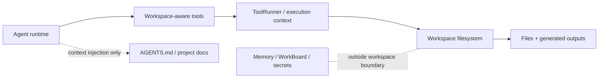

# Workspace

Read this if: you want the filesystem boundary the agent can act inside.

Skip this if: you need long-term knowledge or work-state behavior; those live in [Memory](/architecture/memory) and [Work board and delegated execution](/architecture/workboard).

Go deeper: [Scaling and high availability](/architecture/scaling-ha), [Tools](/architecture/tools), [Artifacts](/architecture/artifacts).

## Workspace boundary

## Purpose

The workspace is the agent's durable filesystem surface. It gives file-oriented tools one explicit working directory so reads, writes, patches, and generated outputs stay containable, operator-visible, and recoverable across runs.

## What this page owns

- The filesystem boundary for tools that read and write project files.
- Durability expectations for single-host and clustered deployments.
- The rule that workspace access happens through the execution boundary, not by arbitrary process reach-through.
- The distinction between filesystem state and StateStore-backed memory/work state.

This page does not define long-term memory, approvals, or low-level ToolRunner mechanics.

## Main flow

1. The agent or execution engine chooses a workspace-backed tool step.
2. ToolRunner mounts or enters the workspace boundary and executes the step relative to that directory.
3. File changes and outputs remain available for later runs, operator inspection, and artifact capture.
4. Selected bootstrap files may also be injected into model context to reduce unnecessary file reads.

## Key constraints

- A workspace is durable across runs; it is not scratch state tied to one transcript.
- Tools must stay inside the workspace boundary and reject traversal outside it.
- In clustered deployments, single-writer semantics matter more than shared RWX convenience.
- Memory, work-state digests, and secrets are not “workspace files”; they stay behind their own boundaries.

## Deployment notes

- Single host: the workspace is a persistent local directory.
- Cluster: the workspace is backed by durable storage and mounted only by the execution context that owns the write lease.

## Related docs

- [Agent](/architecture/agent)
- [Memory](/architecture/memory)
- [Work board and delegated execution](/architecture/workboard)
- [Scaling and high availability](/architecture/scaling-ha)
- [Tools](/architecture/tools)
