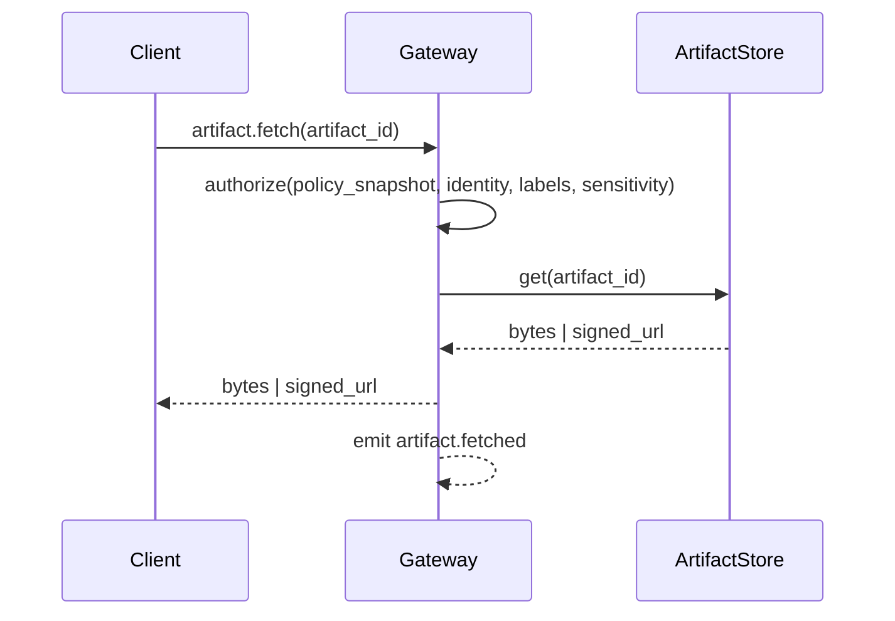

# Artifacts

Artifacts are evidence objects captured during execution (screenshots, diffs, logs, HTTP traces). They exist to make outcomes verifiable, auditable, and reviewable by operators.

Artifacts are attached to execution scope (`run_id`, `step_id`, `attempt_id`) and referenced from events and UI timelines.

## Artifact references and metadata

Artifacts are referenced using `ArtifactRef` (for example `artifact://…` URIs). Metadata is persisted in the StateStore; raw bytes live in an artifact store.

Artifact metadata includes:

- `artifact_id` / `ArtifactRef`
- `agent_id`, `workspace_id`
- execution scope (`run_id`, `step_id`, `attempt_id`)
- `labels[]` (for example `screenshot`, `diff`, `log`, `http_trace`)
- `sensitivity` (for example `normal` or `sensitive`)
- `size_bytes`, `sha256`, `content_type`, `created_at`

## Artifact store

Tyrum uses a pluggable artifact store interface with two baseline implementations:

- **Filesystem store:** local path or mounted volume.
- **S3-compatible object store:** recommended for multi-instance deployments.

The gateway records metadata in the StateStore and stores only references to raw bytes.

## Creation and attachment

Artifacts are created by workers, ToolRunner, and nodes:

- a step attempt writes artifact bytes to the artifact store
- the execution engine persists artifact metadata and attaches `ArtifactRef`s to the attempt record
- `artifact.created` and `artifact.attached` events make the artifact visible in operator clients

## Fetch and access control

Artifact bytes are fetched through the gateway. Clients do not read directly from artifact storage.

Authorization depends on:

- authenticated client device identity
- agent/workspace scope
- artifact `labels` and `sensitivity`
- the effective `PolicyBundle` snapshot attached to the run

For object storage deployments, the gateway issues short-lived signed URLs only after authorization checks succeed. For filesystem deployments, the gateway streams bytes directly.

Artifact fetches are auditable and emit events (for example `artifact.fetched`) that include who accessed what and the policy decision reference.

## Retention and export

Retention is defined by policy with conservative defaults:

- defaults vary by `labels` and `sensitivity`
- quotas apply per agent/workspace
- extending retention for sensitive classes can be approval-gated

Exports preserve:

- artifact references and metadata (including hashes)
- minimal indexes needed to inspect and replay runs
- optional artifact bytes, depending on policy and operator selection

