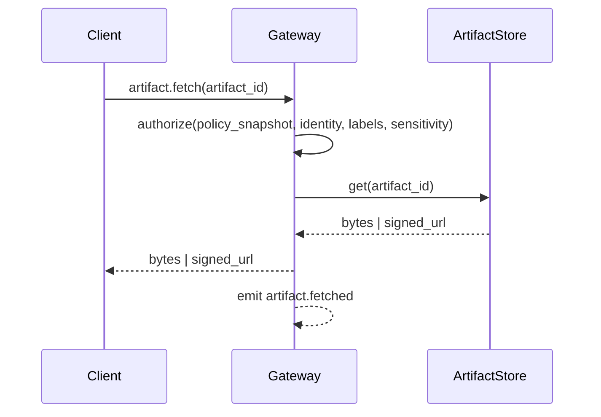

# Artifacts

Artifacts are evidence objects captured during execution (screenshots, diffs, logs, HTTP traces). They exist to make outcomes verifiable, auditable, and reviewable by operators.

Artifacts are attached to execution scope (`run_id`, `step_id`, `attempt_id`) and referenced from events and UI timelines.

## Artifact references and metadata

Artifacts are referenced using `ArtifactRef` (for example `artifact://…` URIs). Metadata is persisted in the StateStore in an `artifact_metadata` table; raw bytes live in an artifact store.

The `artifact_metadata` table schema:

| Column | Type | Purpose |
|---|---|---|
| `artifact_id` | TEXT PK | UUID, matches blob store key |
| `agent_id` | TEXT | Agent that owns the artifact |
| `run_id` | TEXT | Execution run that produced the artifact |
| `step_id` | TEXT | Step within the run |
| `attempt_id` | TEXT | Specific attempt (supports retries) |
| `kind` | TEXT | Artifact kind (log, screenshot, file, etc.) |
| `mime_type` | TEXT | MIME type for content negotiation |
| `size_bytes` | INTEGER | Size for quota/budget tracking |
| `sha256` | TEXT | Content hash for integrity verification |
| `labels` | TEXT | JSON array of string labels for filtering |
| `sensitivity` | TEXT | For example `normal` or `sensitive` |
| `created_at` | TEXT | ISO 8601 timestamp |

## Artifact store

Tyrum uses a pluggable artifact store interface with two baseline implementations:

- **Filesystem store:** local path or mounted volume.
- **S3-compatible object store:** recommended for multi-instance deployments.

The gateway records metadata in the StateStore and stores only references to raw bytes.

## Creation and attachment

Artifacts are created by workers, ToolRunner, and nodes:

- a step attempt writes artifact bytes to the artifact store first
- the execution engine then persists artifact metadata in the StateStore within the same transaction scope, ensuring metadata is never orphaned without a blob
- `ArtifactRef`s are attached to the attempt record
- `artifact.created` and `artifact.attached` events make the artifact visible in operator clients

## Fetch and access control

Artifact bytes are fetched through the gateway. Clients do not read directly from artifact storage.

Authorization depends on:

- authenticated client device identity
- agent/workspace scope
- artifact `labels` and `sensitivity`
- the effective `PolicyBundle` snapshot attached to the run

For object storage deployments, the gateway issues short-lived signed URLs only after authorization checks succeed. For filesystem deployments, the gateway streams bytes directly.

Artifact fetches are auditable and emit events (for example `artifact.fetched`) that include who accessed what and the policy decision reference.

## Design rationale

Durable metadata in the StateStore (separate from blob storage) ensures artifact records survive blob store migrations (for example filesystem to S3), support discovery and filtering by kind/labels/run/step, and enable integrity verification via content hashes. Orphaned metadata rows (where blob storage failed after metadata insert) are detected by periodic reconciliation.

## Retention and export

Retention is defined by policy with conservative defaults:

- defaults vary by `labels` and `sensitivity`
- quotas apply per agent/workspace
- extending retention for sensitive classes can be approval-gated

Artifacts flagged for redaction have their blob deleted while the metadata row is retained with a `redacted` flag. This preserves the audit trail while removing sensitive content.

Exports preserve:

- artifact references and metadata (including hashes)
- minimal indexes needed to inspect and replay runs
- optional artifact bytes, depending on policy and operator selection

