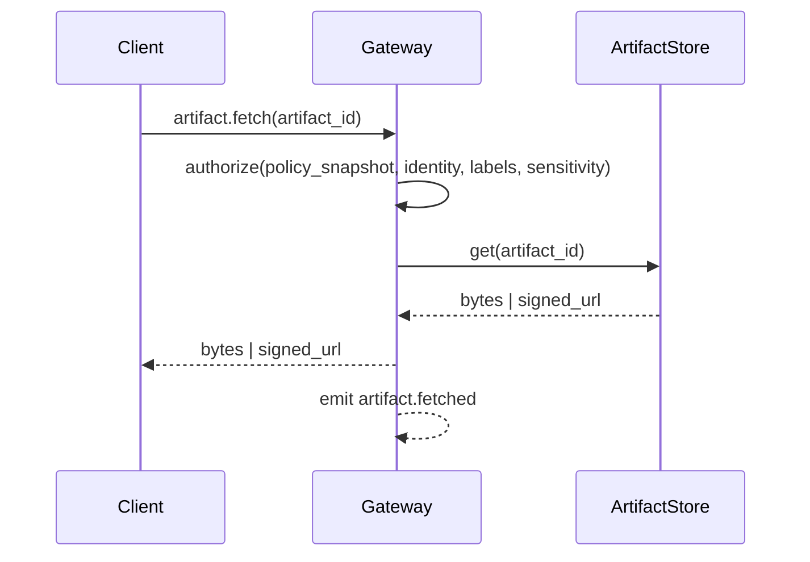

# Artifacts

## Status

- **Status:** Implemented

Artifacts are evidence objects captured during execution (screenshots, diffs, logs, HTTP traces). They exist to make outcomes verifiable, auditable, and reviewable by operators.

Artifacts are attached to execution scope (`run_id`, `step_id`, `attempt_id`) and referenced from events and UI timelines.

## Artifact references and metadata

Artifacts are referenced using `ArtifactRef` (for example `artifact://…` URIs). Metadata is persisted in the StateStore; raw bytes live in an artifact store.

Artifact metadata includes:

- `artifact_id` / `ArtifactRef`
- `tenant_id`
- `agent_id`, `workspace_id`
- execution scope (`run_id`, `step_id`, `attempt_id`)
- `labels[]` (for example `screenshot`, `diff`, `log`, `http_trace`)
- `sensitivity` (for example `normal` or `sensitive`)
- `size_bytes`, `sha256`, `mime_type`, `created_at`

## Artifact store

Tyrum uses a pluggable artifact store interface with two baseline implementations:

- **Filesystem store:** local path or mounted volume.
- **S3-compatible object store:** recommended for multi-instance deployments.

The gateway records metadata in the StateStore and stores only references to raw bytes.

## Creation and attachment

Artifacts are created by workers, ToolRunner, and nodes:

- a step attempt writes artifact bytes to the artifact store
- the execution engine persists artifact metadata and attaches `ArtifactRef`s to the attempt record
- `artifact.created` and `artifact.attached` events make the artifact visible in operator clients

## Fetch and access control

Artifact access is mediated by the gateway. Clients do not access artifact storage without gateway authorization.

Authorization depends on:

- authenticated operator identity (user + client device identity)
- tenant/agent/workspace scope
- artifact `labels` and `sensitivity`
- the policy snapshot reference attached to the artifact/run

### Durable linkage (anti-IDOR hard rule)

Authorization MUST require durable linkage between the requested `artifact_id` and an authorized scope.

In other words: possession of an `artifact_id` is never sufficient. The gateway must prove the artifact is referenced by durable state the requester is authorized to access, for example:

- linked to an execution scope (`run_id`, `step_id`, `attempt_id`) that the requester is authorized for, or
- linked to another durable, policy-authorized scope (for example an export/snapshot object).

If an artifact is not durably linked, the gateway must deny fetch (even if the bytes exist in blob storage). This prevents insecure direct object reference (IDOR) attacks and makes authorization explainable and auditable.

For object storage deployments, the gateway issues short-lived signed URLs only after authorization checks succeed. For filesystem deployments, the gateway streams bytes directly.

In the HTTP API, `GET /runs/:runId/artifacts/:id` streams bytes for filesystem stores and redirects to a signed URL for object stores.

Artifact fetches are auditable and emit events (for example `artifact.fetched`) that include what was accessed and requester metadata.

## Retention and export

Retention is defined by policy with conservative defaults:

- defaults vary by `labels` and `sensitivity`
- quotas apply per agent/workspace
- extending retention for sensitive classes can be approval-gated

See [Data lifecycle and retention](./data-lifecycle.md) for how artifact retention fits into broader StateStore/outbox/transcript lifecycle decisions.

Exports preserve:

- artifact references and metadata (including hashes)
- minimal indexes needed to inspect and replay runs
- optional artifact bytes, depending on policy and operator selection

### Retention + quota policy shape

Retention and quotas are configured in `PolicyBundle.artifacts`:

- `artifacts.retention.default_days`: default retention window in days.
- `artifacts.retention.by_label.<label>`: label-specific retention in days.
- `artifacts.retention.by_sensitivity.(normal|sensitive)`: sensitivity-specific retention in days.
- `artifacts.retention.by_label_sensitivity.<label>.(normal|sensitive)`: most-specific retention in days.

- `artifacts.quota.default_max_bytes`: default quota in bytes.
- `artifacts.quota.by_label.<label>`: label-specific quota in bytes.
- `artifacts.quota.by_sensitivity.(normal|sensitive)`: sensitivity-specific quota in bytes.
- `artifacts.quota.by_label_sensitivity.<label>.(normal|sensitive)`: most-specific quota in bytes.

For lifecycle purposes, the label is the artifact `kind` (for example: `log`, `screenshot`, `diff`, `http_trace`), and sensitivity is `normal` or `sensitive`.

Precedence is “most-specific rule wins”:

1. `by_label_sensitivity.<label>.<sensitivity>`
2. `by_sensitivity.<sensitivity>`
3. `by_label.<label>`
4. `default_days` / `default_max_bytes` (or legacy `retention_days` / `max_bytes`)

The gateway enforces retention/quota by pruning artifact bytes from the ArtifactStore while keeping durable metadata in the StateStore. When bytes are pruned, `execution_artifacts.bytes_deleted_at` and `execution_artifacts.bytes_deleted_reason` are populated; subsequent fetches may return “bytes not found” while metadata remains available for audit.
