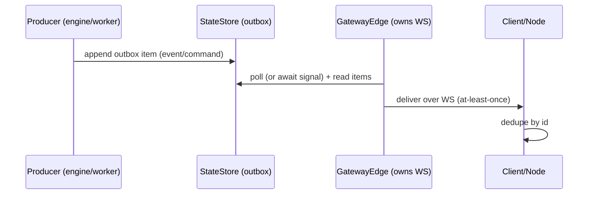

# Backplane (Outbox Contract)

## Status

- **Status:** Implemented

Tyrum is WebSocket-first: most operator UX is powered by server-push events delivered over long-lived WebSocket connections.
When the gateway is replicated, only the edge instance that owns a connection can write to that socket. The **backplane** is the cross-instance mechanism that makes “cluster with N replicas” behave like “cluster with 1 replica” for event delivery.

This page defines the required _behavior_ of the backplane and its durable outbox, independent of any specific implementation (polling, Postgres `LISTEN/NOTIFY`, external pub/sub, etc.).

References:

- [Scaling and high availability](./scaling-ha.md)
- [Protocol events](./protocol/events.md)

## Terms

- **Outbox:** a durable log/table in the StateStore used to publish events and directed commands reliably.
- **Backplane:** a delivery mechanism that moves outbox items to the correct gateway edge instance for fanout to connected peers.
- **Producer:** a component that appends items to the outbox (execution engine, workers, schedulers, etc.).
- **Consumer:** a component that reads items from the outbox to deliver them (gateway edges in particular).
- **Event:** a gateway-emitted notification delivered to clients/nodes (see [Events](./protocol/events.md)).
- **Directed command:** a backplane item targeted at a specific owning edge instance (for example “deliver these events to `device_id=…`”).

## Hard invariants

### At-least-once delivery

Outbox items are delivered **at-least-once**:

- A consumer may observe the same item multiple times.
- A peer may observe the same logical event multiple times (especially across reconnect).

Consumers and peers MUST tolerate duplicates by deduplicating on stable ids (for protocol events, `event_id`).

### No global ordering guarantee

The backplane does **not** provide a global total order:

- Delivery order may differ across peers.
- Events can be observed out of order, especially during reconnect/replay.

If an operator view depends on ordering, it MUST be reconstructible from durable StateStore state (events are an incremental _signal_, not the only source of truth).

### Tenant isolation

In multi-tenant deployments, backplane routing is tenant-scoped:

- outbox items are associated with exactly one `tenant_id`
- consumers deliver items only to connections authenticated within that same tenant

### Durable append

Publishing is durable:

- Producers append outbox items transactionally with the state changes they represent when feasible.
- Once appended, an item survives producer restarts and is eligible for later delivery/replay until retention policy removes it.

## Backplane responsibilities

### Fanout to owning edge

In a cluster, the backplane bridges from “durable outbox item” to “the edge instance that owns a connection”.

The connection directory described in [Scaling and high availability](./scaling-ha.md) provides routing metadata (for example `(device_id → owning_edge_instance)` with TTL heartbeats).

### Delivery loop (conceptual)

Implementations MAY add low-latency signals (for example Postgres `LISTEN/NOTIFY`) to reduce polling latency, but the durable outbox remains the source of truth.

## Retention, replay, and compaction (operational contract)

The outbox is intentionally durable, but it MUST be **bounded**.
Unbounded outbox growth is an operational failure mode (cost, performance, recovery time).

### Retention goals

Retention MUST be sufficient to support:

- edge restarts (items published while an edge is down remain deliverable),
- short-term partitions between edges and the StateStore, and
- peer reconnects where the peer may observe duplicate delivery.

Retention SHOULD be configured so that “typical operational recovery” does not require manual intervention.

### Bounded growth

Implementations MUST have explicit compaction rules, for example:

- time-based TTL (delete items older than a configured window),
- size-based caps (delete/compact when exceeding a row/byte budget), and/or
- per-consumer progress tracking (delete items once all intended consumers have advanced past them).

The exact mechanism is a deployment choice, but the **behavior** must remain at-least-once with dedupe-safe replay within the retention window.

### Replay expectations

Replays happen in practice (restarts, takeovers, reconnect).

- Consumers MUST be able to restart and resume delivery without corrupting durable state.
- Peers MUST treat events as at-least-once and SHOULD refresh critical views from durable APIs after reconnect instead of assuming no gaps or perfect ordering.

If a peer is offline beyond the outbox retention window, it may miss incremental events; recovery MUST be possible by re-reading durable StateStore-backed state.

### Implementation note (gateway defaults)

The gateway enforces outbox retention by periodically pruning:

- `outbox` rows older than `TYRUM_OUTBOX_RETENTION_MS` (default: 24 hours)
- stale `outbox_consumers` rows on the same window

Compaction runs on the `all` and `scheduler` gateway roles, with tick interval configurable via `TYRUM_OUTBOX_COMPACTION_TICK_MS` (default: 5 minutes).
Compaction prunes in batches of up to `TYRUM_OUTBOX_COMPACTION_BATCH_SIZE` rows (default: 10,000) per table and may run multiple batches per tick to catch up.
In Postgres deployments, the gateway uses an advisory lock so only one instance performs compaction at a time.

## Safety and privacy

- Outbox payloads SHOULD avoid embedding raw secret values (prefer secret handles and redaction).
- Treat the outbox and any backplane transport as sensitive data: apply access controls and avoid logging payloads by default.
- Ensure tooling and infra do not leak auth tokens in WebSocket upgrade headers (see [Handshake](./protocol/handshake.md)).
