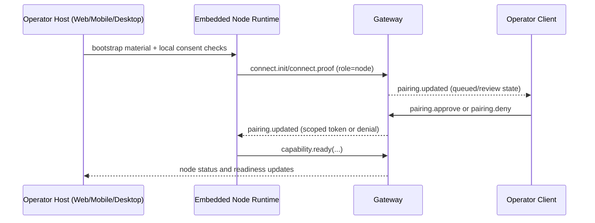

# Embedded local nodes

Read this if: you need to understand how client hosts can expose local device capabilities without collapsing trust boundaries.

Skip this if: you are working on remote node behavior that does not involve host-local bootstrap.

Go deeper: [Node](/architecture/node), [Handshake](/architecture/protocol/handshake), [Presence and Instances](/architecture/presence).

## Core flow

## Purpose

Embedded local nodes let a browser, mobile, or desktop host start a local node runtime while preserving the client/node boundary. The host owns onboarding and consent UX; capability execution still happens through a separately identified `role: node` peer.

## What this page owns

- Host-local bootstrap and consent UX.
- Node runtime startup/shutdown from the host context.
- Separate node identity, pairing lifecycle, and readiness wiring.
- Operator-visible local diagnostics for bootstrap and permissions.

This page does not allow direct client-to-capability RPC and does not replace gateway policy or pairing controls.

## Main flow

1. Operator enables local-node mode in a host surface.
2. Host provisions bootstrap data and starts the embedded runtime.
3. Runtime connects as `role: node`, advertises capabilities, and enters normal pairing/review flow.
4. After approval and readiness, gateway routes capability requests to the embedded runtime like any other node.
5. Host continues presenting status, but trust and authorization remain node-scoped.

## Key constraints

- Client identity and node identity are always separate, even in one app process.
- Embedded local nodes must emit normal node presence, pairing, and `capability.ready` signals.
- Local permission prompts can block readiness independently from client connectivity.
- Bootstrap materials are credential-bearing and must be treated like scoped secrets.

## State and data notes

- Host keeps client identity and operator session state.
- Embedded runtime keeps node identity and pairing authorization state.
- Browser-hosted nodes advertise `mode=browser-node` in presence.
- Mobile bootstrap uses `tyrum://bootstrap?...` payloads carrying gateway base URLs and node bootstrap tokens.

## Failure and recovery

Typical failures are missing permissions, deep-link/bootstrap issues, expired bootstrap tokens, and reconnect churn. Recovery is restart + re-bootstrap + reconnect as `role: node`, without mutating client identity.

## Security and policy posture

Local embedding does not bypass policy, approvals, or capability allowlists. High-risk actions still follow the ordinary node approval and evidence path, even on the same physical device.

## Observability

- Embedded nodes appear as separate node/presence inventory entries.
- Pairing lifecycle is visible through `pairing.updated`.
- Capability readiness and evidence flow through the standard node event stream.

## Related docs

- [Client](/architecture/client)
- [Node](/architecture/node)
- [Capabilities](/architecture/capabilities)
- [Identity](/architecture/identity)
- [Presence and Instances](/architecture/presence)
- [Handshake](/architecture/protocol/handshake)
- [Events](/architecture/protocol/events)
