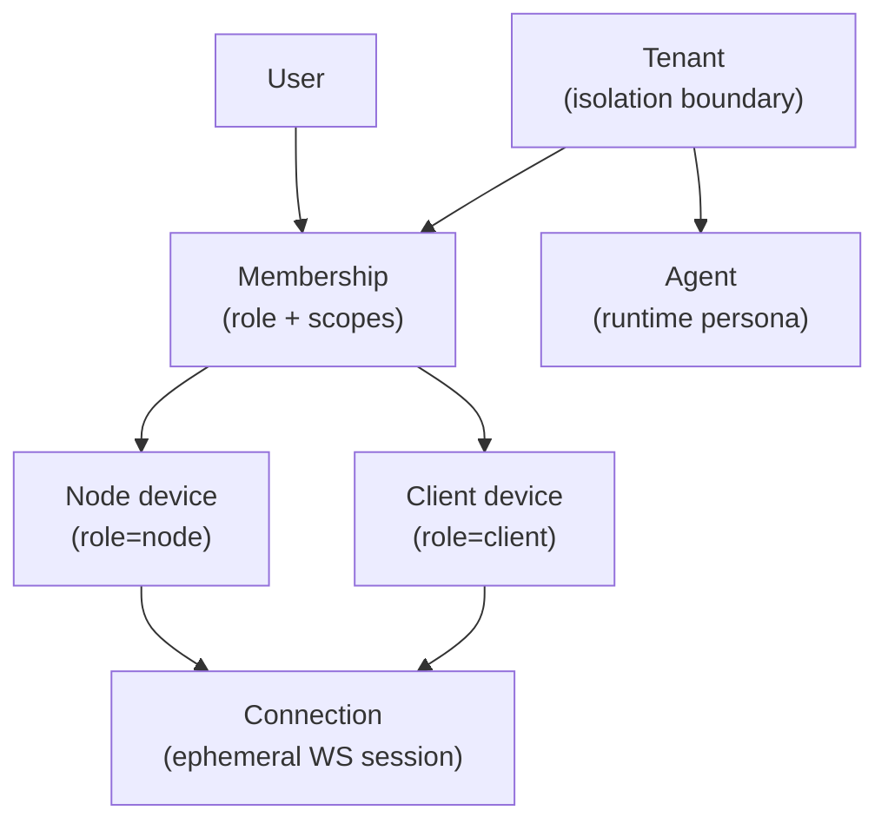

# Identity

Read this if: you need the identity model that ties tenants, users, agents, and devices together.

Skip this if: you are debugging handshake wire details first; use [Handshake](/architecture/protocol/handshake).

Go deeper: [Client](/architecture/client), [Node](/architecture/node), [Handshake](/architecture/protocol/handshake).

Identity is how Tyrum scopes authority to the right tenant, user, agent, and device without mixing those responsibilities together.

## What this page covers

- the durable identities Tyrum treats as security and routing boundaries
- why device identity is separate from user identity
- how ephemeral connections attach to stable principals

## Identity layers

- **Tenant (`tenant_id`)** is the primary isolation boundary. Durable records, events, and policy decisions belong to exactly one tenant.
- **User (`user_id`)** is the human principal authenticated through a tenant-configured auth provider.
- **Membership** binds one user into one tenant with a role and effective scopes.
- **Agent (`agent_id`)** is the durable runtime persona within a tenant.
- **Device (`device_id`)** identifies one client or node endpoint cryptographically.
- **Connection (`connection_id`)** is an ephemeral WebSocket session that becomes trusted only after handshake and auth.

The important split is durable principal vs live connection. A reconnect should create a new `connection_id`, not a new device identity.

## Device identity model

Client and node devices derive identity from a long-lived Ed25519 keypair. The public key is the canonical identity material, and the gateway validates a deterministic `device_id` from it:

`device_id = "dev_" + base32_lower_nopad(sha256(pubkey_der_bytes))`

`base32_lower_nopad` uses the RFC 4648 alphabet (`a-z2-7`), rendered lowercase, with no padding, and `pubkey_der_bytes` is the DER SPKI public key decoded from base64url.

Treat `device_id` as an opaque stable identifier for pairing, revocation, presence, and audit. It is not just a display field.

## Why this boundary exists

- user identity answers **who** is acting
- tenant identity answers **where** the action is allowed
- agent identity answers **which runtime persona** owns state
- device identity answers **which endpoint** is connected and can be paired or revoked

Keeping those layers separate is what makes reconnects, scoped tokens, pairing, and audit trails coherent.

## Related docs

- [Client](/architecture/client)
- [Node](/architecture/node)
- [Presence and Instances](/architecture/presence)
- [Handshake](/architecture/protocol/handshake)
