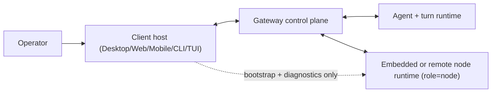

# Client

Read this if you want the operator-surface architecture. Skip this if you need node execution internals; that belongs to [Node](/architecture/node).

A client is an operator-facing surface that connects to the gateway so humans can observe state, steer work, resolve approvals, and manage connected devices.

## What This Page Covers

- The client boundary: what operator surfaces own vs what gateway/node subsystems own.
- The host/runtime split: why embedded local nodes still remain separate `role: node` peers.
- Primary operator flows: connect, observe, steer, approve, and recover.

## Boundary

- **Inside client ownership:** auth bootstrap, WebSocket connection state, operator state presentation, approval actions, diagnostics, and local setup/consent UX.
- **Outside client ownership:** protocol contract enforcement, durable orchestration semantics, policy decisions, and capability execution.

## Primary Flows

### Interactive operator flow

1. Client authenticates and opens a typed gateway connection.
2. Gateway streams turn, approval, pairing, and status updates.
3. Operator sends typed actions (message send, approval resolution, admin requests).
4. Client rehydrates view state after reconnect from durable gateway data.

### Embedded-local-node flow

1. Operator enables local capability runtime from a client host.
2. Host bootstraps node identity/material and starts the local node runtime.
3. Node connects separately as `role: node`, then enters normal pairing/policy flow.
4. Capability execution remains routed gateway -> node, not client -> node direct RPC.

## Invariants

- Client and node identities stay separate even when co-located in one app.
- Client actions remain scope-checked, auditable, and approval-compatible.
- UI transport choice does not alter trust boundaries.

## Failure and Recovery

- **Common failures:** disconnects, expired auth, stale local cache, embedded runtime bootstrap issues.
- **Recovery posture:** reconnect the protocol connection, refresh authoritative state from gateway, and let embedded nodes reconnect/re-advertise independently.

## Not In Scope Here

- Node capability implementation details.
- Turn-processing internals and low-level step mechanics.
- Protocol wire catalogs and event payload schemas.

## Drill-down

- [Architecture](/architecture)
- [Embedded Local Nodes](/architecture/client/embedded-local-nodes)
- [Identity](/architecture/identity)
- [Presence and Instances](/architecture/presence)
- [API surfaces (WebSocket vs HTTP)](/architecture/api-surfaces)
