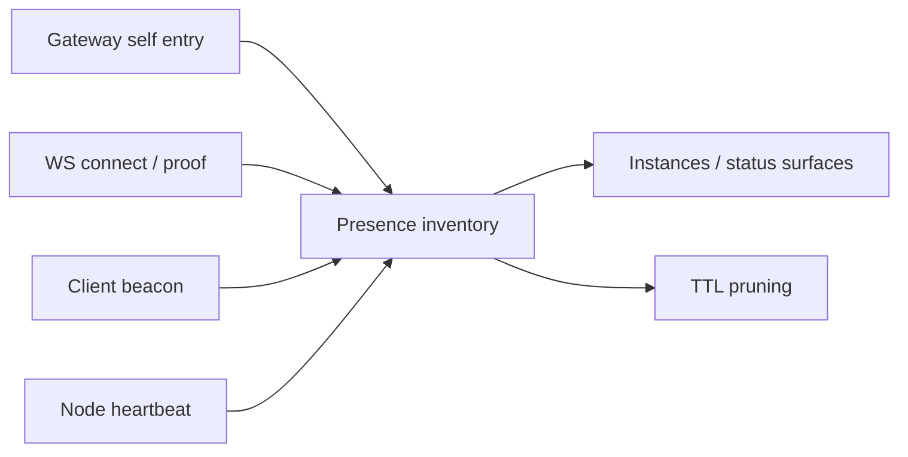

# Presence and Instances

Read this if: you want the diagnostic model for what Tyrum thinks is connected and healthy right now.

Skip this if: you need identity or pairing mechanics first; use [Identity](/architecture/identity) and [Node](/architecture/node).

Go deeper: [Client](/architecture/client), [Node](/architecture/node), [Handshake](/architecture/protocol/handshake).

Presence is Tyrum's lightweight, best-effort inventory of gateway, client, and node instances. It exists for operator visibility, not for authorization.

## Diagnostic boundary

Presence is a **diagnostic surface**, not a security boundary. The authoritative identity is the device-derived `instance_id`. Human-friendly fields such as `host` and `ip` may be self-reported and must never drive authz or policy decisions.

## Entry essentials

Typical fields include:

- `instance_id`: stable device identity
- `role`: `gateway | client | node`
- `host`, `ip`, `version`, `mode`
- `last_seen_at`
- optional activity hints such as `last_input_seconds`
- `reason`: why the row was upserted or pruned

The page is about how those rows are produced and merged, not about exposing every field exhaustively.

## How presence is produced

1. The gateway seeds its own `role=gateway` row at startup.
2. A successful `connect.init/connect.proof` upserts presence for the connecting device.
3. Clients may send richer periodic beacons for UI-friendly details.
4. Nodes refresh their rows while connected.

Embedded local nodes still produce their own rows because they use a different device identity than the host client.

## Merge and retention model

- Presence is keyed by stable `instance_id`, so reconnect updates an existing row instead of creating duplicates.
- Co-located client and node runtimes do not merge because their identities and roles are intentionally distinct.
- Rows are pruned by TTL and bounded-cap rules to keep the inventory ephemeral and useful.

Tunnel caveat: the observed remote address can be misleading under local forwarding (`127.0.0.1`). If clients report additional host/IP metadata, those fields must be labeled as reported values rather than replacing the observed address.

## Why operators care

Presence powers:

- the Instances view in the operator UI
- `/presence` and `/status` outputs
- diagnostics exports for support work

That makes it valuable for visibility and debugging, but not authoritative for trust.

## Related docs

- [Client](/architecture/client)
- [Node](/architecture/node)
- [Identity](/architecture/identity)
- [Handshake](/architecture/protocol/handshake)
