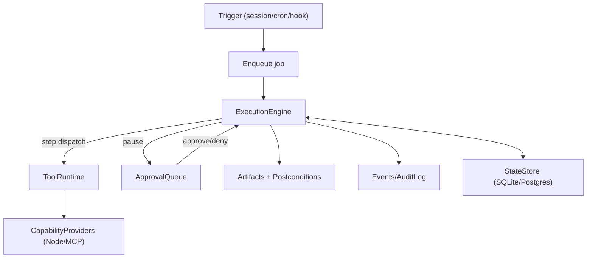

# Execution engine

Status:

The execution engine is the gateway subsystem responsible for turning a plan or workflow into **resilient, auditable execution**. It is where reliability guarantees live: retries, idempotency, budgets/timeouts, pause/resume, and evidence capture.

## Why it exists

LLMs are good at planning, but they are a poor place to host the control plane for long-running, side-effecting work. The execution engine moves orchestration into a typed runtime so that:

- Side effects can be **paused** behind approvals and **resumed** safely later.
- Runs can be **retried** deterministically without duplicating actions.
- “Done” is backed by **postconditions + artifacts**, not narrative.
- Operator UIs can observe progress in real time via events.

## Responsibilities

- **Queueing and scheduling:** accept work from interactive sessions, cron jobs, hooks, and external triggers.
- **Run state machine:** track run lifecycle (`queued → running → paused|succeeded|failed|cancelled`) with durable persistence.
- **Step execution:** execute steps via the tool runtime and capability providers (nodes, MCP).
- **Idempotency + safe retries:** enforce `idempotency_key` semantics for side-effecting steps and define retry policies.
- **Approvals and pause/resume:** pause runs when an approval is required and resume using a durable resume token.
- **Budgets and timeouts:** enforce cost/time ceilings per run and per step (including model budgets where applicable).
- **Concurrency limits:** limit parallelism per agent, per lane, per capability provider, and globally.
- **Evidence and verification:** capture artifacts and validate postconditions (required for state-changing steps when feasible).
- **Auditability:** emit events for run/step lifecycle and persist a run log suitable for troubleshooting and export.

## Distributed execution (workers)

The execution engine can run co-located with the gateway edge (even in the same OS process) or be split into separate processes/hosts. To minimize surprises when scaling up, the same execution semantics apply in all deployments: workers claim/lease work in the StateStore and publish lifecycle events through the backplane abstraction (see [Scaling and High Availability](./scaling-ha.md)).

Cluster-safe execution typically requires:

- **Claim/lease:** workers claim work with a time-bounded lease recorded in the StateStore so only one worker executes a given attempt at a time.
- **Idempotency:** side-effecting steps define `idempotency_key` semantics so retries are safe under at-least-once execution.
- **Lane serialization:** workers acquire a distributed lock/lease keyed by `(session_key, lane)` before executing steps that must be serialized.
- **Durable outcomes:** attempt results, artifacts, and postcondition evaluations are persisted before emitting “completed” events.

## Non-responsibilities

- The execution engine does not decide *what* to do from a user message (planning is in the agent/planner).
- The execution engine does not implement device-specific automation (that lives behind node capabilities).
- The execution engine does not store raw secrets (that lives behind the secret provider).

## Core concepts

### Job vs run

- **Job:** the queued unit of work (created by a session request, cron, or hook).
- **Run:** an execution attempt of a job. A job can create multiple runs due to retries or operator-requested replays.

### Step and attempt

- **Step:** one atomic action in a workflow (for example “HTTP request”, “click button”, “send message”).
- **Attempt:** one execution attempt of a step (attempt count increments on retry).

### Pause/resume

When a run reaches a step that requires approval (or takeover), the engine:

1. Persists the run in a **paused** state.
2. Creates an **approval request** record.
3. Returns/emits a **resume token** that references the paused state.
4. Resumes only after the approval is resolved (approved/denied/expired).

## Evidence + postconditions (hard rule)

For **state-changing** steps, a postcondition should be defined whenever a verification check is feasible. The engine is responsible for executing and evaluating the postcondition and storing evidence artifacts.

If a step cannot be verified automatically, the engine must:

- Mark the outcome as **unverifiable** (not “done”), and
- Escalate to the operator (approval/takeover) before proceeding with further dependent side effects.

## Topology (conceptual)

## Data model sketch (conceptual)

- `jobs(id, created_at, trigger_type, trigger_key, agent_id, lane, status, input, ...)`
- `runs(id, job_id, started_at, finished_at, status, attempt, budgets, ...)`
- `run_steps(id, run_id, index, kind, args, idempotency_key, approval_id?, postcondition, ...)`
- `run_step_attempts(id, run_step_id, attempt, started_at, finished_at, status, result, error, artifacts[])`

Exact schemas belong in `@tyrum/schemas` and exported contracts.

## Client/UI expectations

Operator clients should be able to:

- See run progress as a timeline (queued/running/paused/completed).
- Inspect per-step evidence (artifacts) and postcondition results.
- Resolve approvals and resume/cancel paused runs.
- Request safe retries or rollbacks when supported.

