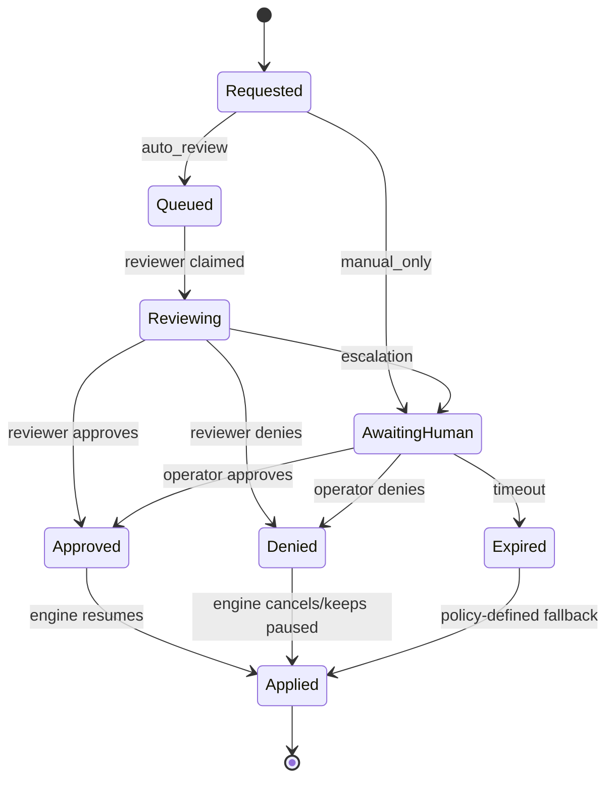

# Approvals

Approvals are Tyrum's durable enforcement surface for risky actions. They are created by policy checks and execution steps, and they gate side effects until an explicit decision is recorded.

## Quick orientation

- Read this if: you need the lifecycle of approval-gated work.
- Skip this if: you need queue internals or review processor implementation details.
- Go deeper: [Reviews](./reviews.md), [Policy overrides](./policy-overrides.md), [Turn Processing and Durable Coordination](/architecture/turn-processing).

## Lifecycle at a glance

Approvals are durable records, not transient prompts. Every transition is auditable and safe under retries.

## What approvals gate

- State-changing workflow steps and playbook execution.
- Sensitive tool scopes (filesystem, shell, secrets, node capability dispatch).
- External messaging to new destinations.
- Human takeover and high-risk automation actions.
- Node/device pairing when policy requires explicit trust decisions.

## Review and resume model

1. The gateway persists an approval request with scope (`tenant_id`, `approval_id`, `conversation_id`, `turn_id`, and linked evidence ids when present).
2. Review mode sets the initial posture: `queued` for `auto_review`, `awaiting_human` for `manual_only`.
3. Resolution writes a terminal outcome atomically: `approved`, `denied`, `expired`, or `cancelled`.
4. Side effects are driven from durable state: resume, cancel, or remain paused based on policy.

When a turn is blocked for approval, the request includes a `resume_token` that maps to blocked turn state. Resume never replays already accepted side effects.

## Outcomes and operator choices

| Choice         | Effect on current turn    | Durable authorization impact   |
| -------------- | ------------------------- | ------------------------------ |
| Approve once   | Resume gated work         | None                           |
| Approve always | Resume gated work         | Creates narrow policy override |
| Deny / Expire  | Cancel or hold per policy | None                           |

`approve always` is still enforcement. It creates an auditable, revocable override and must never bypass explicit `deny`.

## Cluster and delivery guarantees

- Any gateway edge can accept resolution requests because approvals live in the StateStore.
- Resolution transitions are atomic, so duplicate submissions are safe.
- Resume/cancel actions are executed through durable leased work queues to avoid duplicate side effects.
- `approval.updated` is at-least-once delivery; clients dedupe with `event_id`.

## Request and resolution essentials

Common request fields:

- `approval_id`, `approval_key`, `kind`, `prompt`, `motivation`
- execution scope identifiers and optional bounded `context`
- optional `suggested_overrides`
- `expires_at`, optional `resume_token`
- `latest_review` and `reviews` when review state already exists

Common resolution fields:

- `outcome`, `resolved_at`, `resolved_by`
- optional `reason`
- optional `mode` (`once` or `always`)
- optional `policy_override_id` when `mode=always`

## Suggested overrides (tool-policy approvals)

When an approval is tool-policy-driven, clients can offer bounded `suggested_overrides`:

- match against a stable, tool-defined target
- prefer narrow prefix patterns
- avoid broad wildcards
- never propose a suggestion that bypasses an explicit deny

Detailed normalization and pattern guidance lives in [Tools](./tools.md).

## Observable events and UI expectations

Key events:

- `approval.updated`
- `policy_override.created`, `policy_override.revoked`, `policy_override.expired`
- `turn.blocked`, `turn.resumed`, `turn.cancelled`

Operator surfaces should provide queue filters, review state, impact preview, clear once/always/deny actions, and deep links into linked turns and overrides.

## Related docs

- [Reviews](./reviews.md)
- [Policy overrides](./policy-overrides.md)
- [Tools](./tools.md)
- [Turn Processing and Durable Coordination](/architecture/turn-processing)
