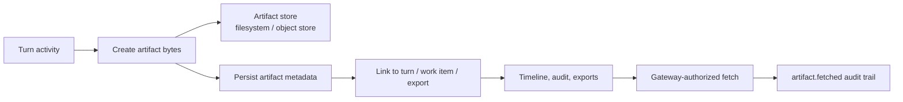
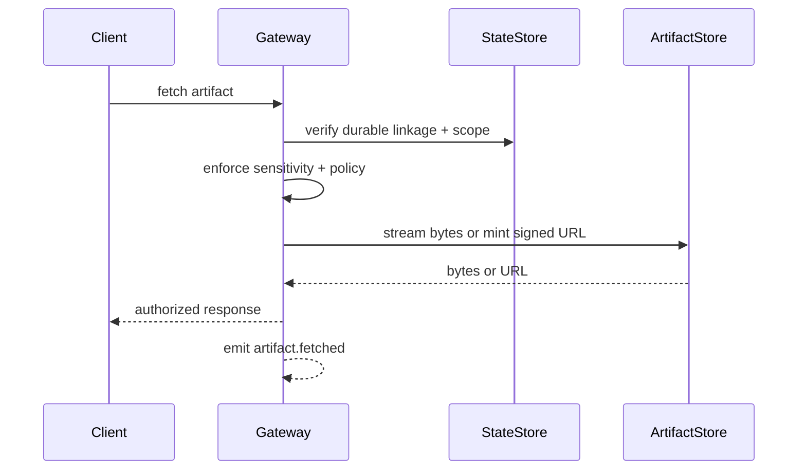

# Artifacts

Artifacts are the evidence layer for turn processing. They let operators inspect what a turn produced without treating model narration as proof.

## Quick orientation

- Read this if: you need to know what artifacts are, where they live, and how access is enforced.
- Skip this if: you only need retention-table details or storage backend implementation.
- Go deeper: [Turn Processing and Durable Coordination](/architecture/turn-processing), [Observability](/architecture/observability), [Data lifecycle and retention](/architecture/data-lifecycle).

## Evidence flow

Artifacts are referenced from durable turn or work scope such as `turn_id`, `conversation_id`, or `work_item_id`. The metadata is how Tyrum explains why an artifact exists and who is allowed to see it.

## What gets stored

The gateway keeps metadata in the StateStore and bytes in a dedicated artifact store.

Common metadata includes:

- stable id and `ArtifactRef`
- tenant, agent, and workspace scope
- durable linkage (`conversation_id`, `turn_id`, `work_item_id`, export id, or similar)
- labels such as `screenshot`, `diff`, `log`, or `http_trace`
- sensitivity, size, hash, MIME type, and creation time

This split keeps retention, auditing, and authorization explainable even when raw bytes are pruned later.

## Access boundary

Artifact fetches are always gateway-mediated. Clients do not fetch blob storage directly until the gateway has already authorized the request.

### Anti-IDOR rule

Possessing an `artifact_id` is never enough. The gateway must prove the artifact is durably linked to a turn, work item, export, or other authorized object. If that linkage is missing, fetch must fail even if the bytes still exist in storage.

## Retention and pruning

Retention and quota policy are driven by label and sensitivity. The general shape is:

- keep metadata longer than raw bytes
- prune bytes first when retention or quota rules require it
- preserve hashes and linkage so old artifacts remain auditable even after content deletion

This is why an operator may still see that a screenshot existed even if the underlying bytes have already been pruned.

## Hard invariants

- Artifacts are evidence objects, not an uncontrolled file bucket.
- Authorization is based on durable linkage plus policy, never on storage location alone.
- Sensitive artifacts must stay subject to the same audit and fetch controls as approval or secret-related records.
- Hashes and metadata should survive long enough to support audit, export, and replay reasoning.

## Related docs

- [Turn Processing and Durable Coordination](/architecture/turn-processing)
- [Observability](/architecture/observability)
- [Secrets](/architecture/secrets)
- [Data lifecycle and retention](/architecture/data-lifecycle)
- [Data model map](/architecture/data-model-map)
