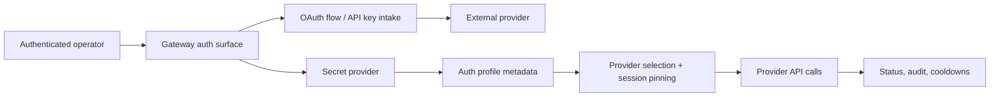

# Provider auth and onboarding

Provider auth is how Tyrum connects operators, stored credentials, and model/provider routing without ever treating raw credentials as ordinary runtime data.

## Quick orientation

- Read this if: you need the onboarding and credential-selection boundary for providers.
- Skip this if: you already know the profile model and only need model fallback rules.
- Go deeper: [Secrets](/architecture/secrets), [Models](/architecture/models), [Observability](/architecture/observability).

## Auth boundary

The gateway stores metadata and secret handles. Raw keys or tokens live in the secret provider and are resolved only by trusted execution paths.

## What an auth profile is

An auth profile is the durable record Tyrum uses for routing and health decisions. It typically contains:

- stable `profile_id`
- provider identity
- auth type such as API key, OAuth, or non-refreshing bearer token
- secret handles for the credential material
- expiry, labels, and operator-facing notes

Profiles are agent-scoped by default. Cross-agent sharing is not the normal path because it weakens audit and blast-radius boundaries.

## Onboarding flows

### API keys

An operator submits the credential through an authenticated control path. The gateway writes the raw value into the secret provider, stores only the returned handle, and creates the profile metadata record.

### OAuth

The gateway owns the authorization-code flow, PKCE/state protection, and callback handling. After token exchange:

- access and refresh material goes into the secret provider
- profile metadata records the provider, labels, and expiry state
- later refreshes update handles and health state without exposing raw tokens to the model

Multiple accounts are simply multiple profiles for the same provider.

## Selection, pinning, and failure handling

Credential choice should be deterministic, not accidental. Tyrum therefore:

- selects from an explicit order when configured
- otherwise falls back to a stable provider-local ordering
- pins the selected profile per session so behavior is repeatable
- cools down or disables bad profiles based on classified failures

Typical reactions:

- transient or rate-limit errors: rotate to another eligible profile and apply cooldown
- invalid or revoked auth: disable the profile until re-authenticated
- quota or billing exhaustion: mark the profile unavailable and continue with allowed alternatives

## Hard invariants

- Raw credentials do not enter model context.
- Auth changes are operator-authenticated and auditable.
- Profile routing stays deterministic enough to explain why a provider call used a specific credential.
- Refresh, disable, and rotation state are visible to operators instead of failing silently.

## Related docs

- [Secrets](/architecture/secrets)
- [Models](/architecture/models)
- [Observability](/architecture/observability)
- [Policy overrides](/architecture/policy-overrides)
