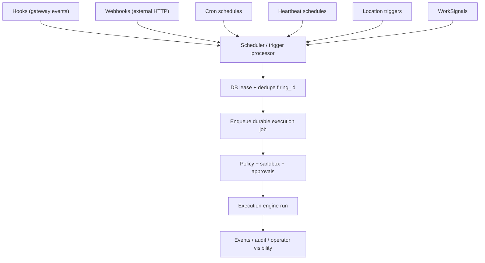

# Automation

Automation is the gateway subsystem that turns time, events, and external signals into durable execution requests under the same safety controls as interactive runs.

## Quick orientation

- Read this if: you need trigger types and the shared automation execution path.
- Skip this if: you need low-level scheduler table mechanics.
- Go deeper: [Location automation](/architecture/gateway/location-automation), [Execution engine](/architecture/execution-engine), [Work board and delegated execution](/architecture/workboard).

## Trigger taxonomy and shared path

Different trigger types share the same execution boundary. That is the key invariant.

## Trigger types

| Trigger     | Best use                                         | Typical execution mode                            |
| ----------- | ------------------------------------------------ | ------------------------------------------------- |
| Heartbeat   | Context-aware periodic triage in main session    | `agent_turn`                                      |
| Cron        | Narrow fixed cadence jobs                        | `agent_turn`, `playbook`, or explicit `steps`     |
| Webhook     | External event ingress                           | usually dedicated lane/session with minimal scope |
| Hooks       | Gateway lifecycle/operator command events        | explicit `steps` or playbook dispatch             |
| Location    | Place/category enter/exit/dwell transitions      | `agent_turn`, `playbook`, or explicit `steps`     |
| WorkSignals | Deferred or event-driven follow-up on work state | delegated execution through WorkBoard/runtime     |

## Schedule model (what users configure)

User-facing automation is expressed as schedules even though storage currently uses watcher tables.

A schedule contains:

- `kind`: `heartbeat` or `cron`
- `cadence`: interval or cron expression
- `execution`: `agent_turn`, `playbook`, or explicit `steps`
- `delivery`: `quiet` or `notify`

State semantics:

- `enabled=false`: paused but retained
- `active=false`: deleted/tombstoned

The scheduler converts schedules into durable firings and execution jobs so retry, audit, and lease behavior is consistent.

## Default heartbeat behavior

- automation is enabled by default
- one default heartbeat is seeded per agent/workspace membership
- default cadence is 30 minutes, `agent_turn`, delivery `quiet`
- seeding is idempotent (no duplicate defaults)
- deleting writes a tombstone to prevent unwanted recreation

## Safety and security expectations

- automation runs under the same policy, approval, and sandbox controls as interactive execution
- webhooks must be authenticated, replay-resistant, and rate-limited
- webhook secrets are stored via secret handles, not query strings
- hooks must come from explicit allowlists; no broad discovery by default
- location and webhook triggers should run with minimal required scope

## Hooks and webhook specifics

Hooks are allowlisted workflows bound to gateway events such as `gateway.start`, `gateway.shutdown`, and `command.execute`. They enqueue work in the execution engine (often lane `cron`) and still honor policy snapshots.

Webhooks are scoped ingress points for external systems. They should map inbound signals to explicit execution intents, not arbitrary command execution.

## Cluster safety and reliability

Automation correctness depends on leased scheduling:

- one scheduler instance owns a trigger shard lease at a time
- leases renew and expire for safe takeover
- each firing carries durable identity (`firing_id`) so downstream dedupe is safe
- enqueue/execution/audit references stable trigger metadata for replay and investigations

## Related docs

- [Location automation](/architecture/gateway/location-automation)
- [Approvals](/architecture/approvals)
- [Execution engine](/architecture/execution-engine)
- [Work board and delegated execution](/architecture/workboard)
