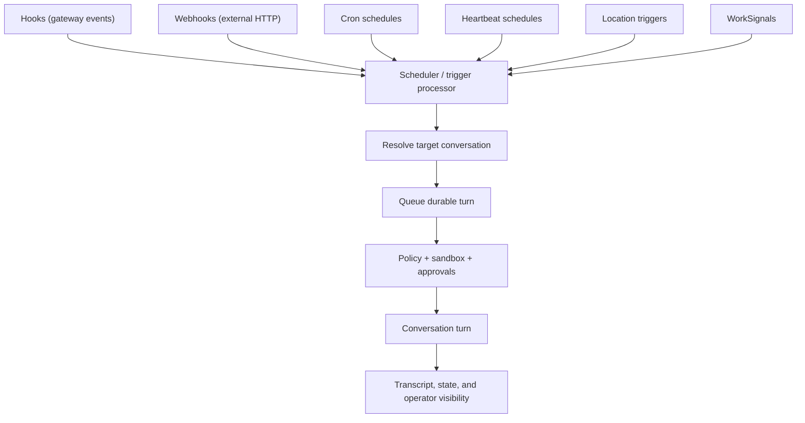

# Automation

Automation is the gateway subsystem that turns time, events, and external signals into durable conversation turns under the same safety controls as interactive work.

## Quick orientation

- Read this if: you need trigger types and the shared automation path.
- Skip this if: you need low-level scheduler table mechanics.
- Go deeper: [Location automation](/architecture/gateway/location-automation), [Turn Processing and Durable Coordination](/architecture/turn-processing), [Work board and delegated execution](/architecture/workboard).

## Trigger taxonomy and shared path

Different trigger types share the same turn boundary. That is the key invariant.

## Trigger types

| Trigger     | Best use                                     | Typical target                                 |
| ----------- | -------------------------------------------- | ---------------------------------------------- |
| Heartbeat   | Context-aware periodic triage                | dedicated heartbeat conversation               |
| Cron        | Narrow fixed cadence jobs                    | dedicated automation conversation              |
| Webhook     | External event ingress                       | dedicated automation conversation              |
| Hooks       | Gateway lifecycle or operator command events | dedicated automation conversation              |
| Location    | Place/category enter/exit/dwell transitions  | dedicated automation conversation              |
| WorkSignals | Deferred or event-driven follow-up on work   | existing originating conversation or child one |

## Schedule model

User-facing automation is expressed as schedules.

A schedule contains:

- `kind`: `heartbeat` or `cron`
- `cadence`: interval or cron expression
- `delivery`: `quiet` or `notify`
- `target`: one durable conversation policy

## Default heartbeat behavior

- automation is enabled by default
- one default heartbeat is seeded per agent/workspace membership
- default cadence is 30 minutes, delivery `quiet`
- heartbeat always targets one dedicated conversation per `(agent, workspace)`
- deleting writes a tombstone to prevent unwanted recreation

## Safety and security expectations

- automation executes under the same policy, approval, and sandbox controls as interactive turns
- webhooks must be authenticated, replay-resistant, and rate-limited
- webhook secrets are stored via secret handles, not query strings
- hooks must come from explicit allowlists; no broad discovery by default
- automation should run with the narrowest required conversation scope

## Hooks and webhook specifics

Hooks are allowlisted workflows bound to gateway events such as `gateway.start`, `gateway.shutdown`, and `command.execute`. They target explicit conversations so their continuity and approvals remain inspectable.

Webhooks are scoped ingress points for external systems. They should map inbound signals to explicit conversations and turns, not arbitrary command execution.

## Cluster safety and reliability

Automation correctness depends on leased scheduling:

- one scheduler instance owns a trigger shard lease at a time
- leases renew and expire for safe takeover
- each firing carries durable identity so downstream dedupe is safe
- queued turns and transcript metadata keep replay and investigation coherent

## Related docs

- [Location automation](/architecture/gateway/location-automation)
- [Approvals](/architecture/approvals)
- [Turn Processing and Durable Coordination](/architecture/turn-processing)
- [Work board and delegated execution](/architecture/workboard)
