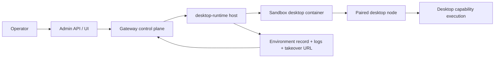

# Desktop environments

Read this if: you need the control-plane model for gateway-managed sandbox desktops.

Skip this if: you only need ordinary node pairing or desktop capability semantics.

Go deeper: [Node](/architecture/node), [Capabilities](/architecture/capabilities), [Scaling and High Availability](/architecture/scaling-ha).

## Managed desktop topology

## Purpose

Desktop environments let operators provision disposable desktop automation targets without pre-installing and hand-pairing a separate desktop node. The gateway owns the lifecycle and desired state; the sandbox still executes as a normal node with a deliberately narrow allowlist.

## What this boundary owns

- Environment inventory, host health, and desired-running reconciliation.
- Admin APIs to create, start, stop, reset, inspect, and delete environments.
- Sandbox bootstrap material: node identity, credentials, and managed-pairing posture.
- Status, logs, and trusted takeover metadata surfaced back to operators.

It does not own the desktop automation contract itself. Once booted, the sandbox executes behind the ordinary node boundary.

## Main control flow

1. An operator creates or updates an environment through the gateway control plane.
2. A `desktop-runtime` host reconciles desired state, prepares identity/token material, and starts or stops the sandbox container.
3. The sandbox connects back as `role: node`, advertises desktop capabilities, and is approved under the managed desktop policy.
4. The gateway updates the durable environment record with status, node identity, takeover URL, logs, and last error.

## Invariants

- Managed desktops still become ordinary paired nodes before capability dispatch is allowed.
- Managed pairing narrows access to the desktop capability surface; it does not grant broad device access.
- Operators interact through gateway control APIs, not by mutating containers out of band.
- Takeover links must resolve only to trusted runtime-host endpoints.

## Failure and recovery

- **Common failures:** host unavailable, image mismatch, sandbox startup failure, token/bootstrap drift.
- **Recovery posture:** reconciliation records the error durably, preserves logs, and allows reset/restart without breaking the node control model.

## Related docs

- [Gateway](/architecture/gateway)
- [Node](/architecture/node)
- [Capabilities](/architecture/capabilities)
- [Scaling and High Availability](/architecture/scaling-ha)
- [Gateway data model map](/architecture/data-model-map)
