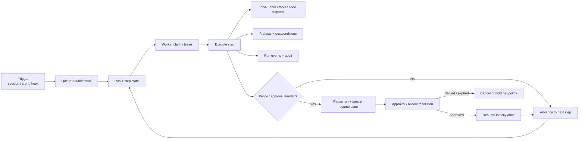

# Execution engine

The execution engine is the gateway subsystem that turns intent into durable work. It exists so long-running, side-effecting runs can pause, recover, retry, and prove what happened without relying on model memory.

## Quick orientation

- Read this if: you need the mental model for jobs, runs, pauses, retries, and evidence.
- Skip this if: you are debugging lease renewal, queue internals, or executor plumbing.
- Go deeper: [Execution runtime mechanics](/architecture/execution-engine/runtime-mechanics), [Approvals](/architecture/approvals), [Artifacts](/architecture/artifacts), [Scaling and High Availability](/architecture/scaling-ha).

## Durable run model

The key idea is simple: the durable record is authoritative. Executors can restart, clients can disconnect, and approvals can take time because progress is driven from persisted state rather than from an in-memory workflow.

## What the engine owns

- Accepting work from interactive sessions, automation, and external triggers.
- Persisting run state (`queued`, `running`, `paused`, `succeeded`, `failed`, `cancelled`).
- Claiming work safely across one process or many workers.
- Enforcing retry, timeout, concurrency, and budget rules.
- Pausing for approval or clarification and resuming without replaying completed side effects.
- Capturing artifacts, postconditions, and lifecycle events for operator inspection.

## Why durable execution matters

### Safe retries

Retries are only useful if they do not duplicate side effects. The engine therefore pairs retry policy with idempotency and attempt tracking. A step can be retried because the runtime knows which attempt ran, what completed, and what outcome was already persisted.

### Pause and resume

Approvals, reviews, and operator intervention do not live in prompt text. The engine persists paused state, stores the approval linkage, and resumes from the durable checkpoint after resolution.

### Evidence over narration

State-changing work should produce artifacts or postcondition checks whenever verification is feasible. If verification is not possible, the engine should surface the outcome as needing operator judgment rather than silently calling it done.

## Deployment shape

The same model applies in single-host and clustered deployments:

- Single host: the gateway and executor may run side by side and access a local workspace directly.
- Cluster: workers claim leased work from the StateStore and delegate execution into a trusted ToolRunner or sandbox that has the required workspace access.

Either way, completion is only real after the attempt result, evidence, and emitted state have been durably recorded.

## Hard invariants

- Durable state, not transient memory, is the source of truth for execution progress.
- Approval-gated work never continues until a durable approval outcome exists.
- Completed steps are not re-run just because a worker restarted.
- Side-effecting work should be paired with evidence or an explicit operator-visible unverifiable outcome.
- Cluster scaling must preserve claim/lease safety and at-least-once event publication.

## What the engine does not own

- Choosing the high-level plan from a user message. That belongs to the agent runtime and WorkBoard.
- Device-specific execution internals behind paired nodes.
- Raw secret storage or credential management.

## Related docs

- [Execution runtime mechanics](/architecture/execution-engine/runtime-mechanics)
- [Approvals](/architecture/approvals)
- [Reviews](/architecture/gateway/reviews)
- [Artifacts](/architecture/artifacts)
- [WorkBoard delegated execution](/architecture/workboard/delegated-execution)
- [Scaling and High Availability](/architecture/scaling-ha)
