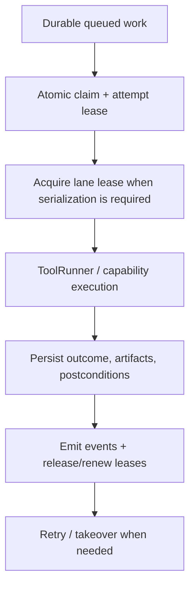

# Execution runtime mechanics

Read this if: you need the exact mechanics that keep execution durable and replay-safe.

Skip this if: you only need the execution-engine mental model; start with [Execution engine](/architecture/execution-engine).

Go deeper: [Approvals](/architecture/approvals), [Artifacts](/architecture/artifacts), [Scaling and High Availability](/architecture/scaling-ha).

## Mechanics path

## Scope

This page covers the lower-level execution contracts behind durability: claims, leases, idempotency, lane serialization, ToolRunner delegation, pause/resume, and recovery.

## Claim and lease model

- Work claims are durable and atomic, so at most one worker owns a given attempt at a time.
- Leases record owner plus expiry and are renewed while active.
- Takeover happens only after expiry and must tolerate duplicate observation.
- Outcomes are persisted before a lease is released.

## Idempotency and retry

State-changing steps use durable idempotency keys:

- duplicate observations return stored outcomes instead of replaying side effects
- automatic retries apply only where idempotency semantics are defined
- retry history remains inspectable at the attempt level

Idempotency is part of the execution contract, not an optimization.

## Lane serialization

Some work must remain serialized per `(session_key, lane)`:

- workers acquire a lane lease before executing serialized work
- follow-up work remains queued durably while the lane is busy
- safe takeover uses the same expiry model as other work leases

This keeps transcript and tool state coherent across single-host and clustered deployments.

## ToolRunner boundary

Workers coordinate state, approvals, retries, and eventing in the StateStore. ToolRunner performs the workspace-mounted execution itself, then writes outcomes, artifacts, and postcondition reports back before completion events are emitted.

## Pause, resume, and cancellation

Approvals and other blockers persist pause state before work stops:

1. transition the run to `paused`
2. persist blocker metadata or approval context
3. store the durable resume reference
4. continue from the persisted step boundary instead of replaying completed work

Cancellation follows the same rule: record intent first, then interrupt at a safe boundary.

## Recovery posture

- duplicate deliveries are expected and must be deduped
- worker death is recovered through lease expiry and reassignment
- paused runs survive restarts and remain inspectable
- durable run state stays authoritative even when event delivery replays

## Related docs

- [Execution engine](/architecture/execution-engine)
- [Approvals](/architecture/approvals)
- [Artifacts](/architecture/artifacts)
- [WorkBoard delegated execution](/architecture/workboard/delegated-execution)
- [Scaling and High Availability](/architecture/scaling-ha)
