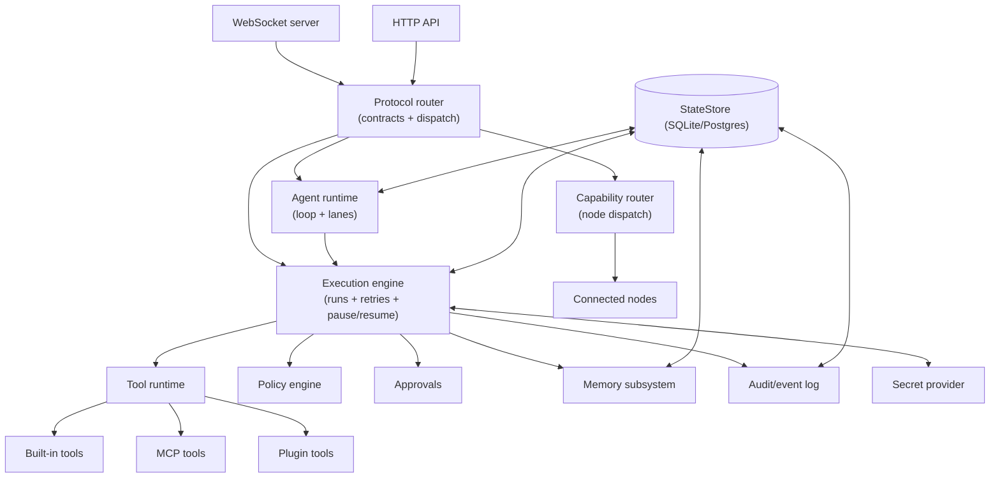

# Gateway

The gateway is Tyrum's long-lived service component. It is the system's authority for connectivity, policy enforcement, validation, routing, orchestration, and durable state coordination.

Deployments range from a single host (replica count = 1) to multi-instance clusters (replicated gateway edges and workers). The gateway coordinates execution and event delivery via the StateStore and event backplane across deployment sizes. See [Scaling and High Availability](../scaling-ha.md).

## Responsibilities

- Maintain long-lived connections to clients, nodes, channels, and model providers.
- Expose typed APIs (WebSocket-first; HTTP where appropriate).
- Validate inbound/outbound messages against contracts.
- Route requests to internal modules or to capable nodes.
- Emit events for lifecycle, actions, and state changes.
- Persist essential state (sessions, transcripts, memory, audit logs) via the StateStore.
- Host the **execution engine** (queue, retries, idempotency, pause/resume, evidence capture). Step execution is performed by workers coordinated via the StateStore (workers may be co-located/in-process or run as separate processes/hosts).
- Host the **approvals** subsystem and enforce policy at tool boundaries.
- Integrate with a **secret provider** so raw credentials are never exposed to the model.
- Host automation triggers (hooks, cron, heartbeat) in a controlled way.
- Provide a stable extension surface (tools, plugins, skills, MCP).

## Non-responsibilities

- The gateway should not perform device-specific automation directly. Device and UI automation live behind node capabilities.
- The gateway should not require a specific client UI; multiple clients can exist concurrently.

## Internal topology

## Key interfaces

- **Client interface:** WebSocket requests/responses + server-push events.
- **Node interface:** WebSocket with pairing, capability advertisement, and capability RPC.
- **Extensions:** tool schemas, plugin registration, and (optionally) MCP servers.
- **Execution/approvals:** requests/events for starting runs, streaming progress, pausing for approval, and resuming with resume tokens.
