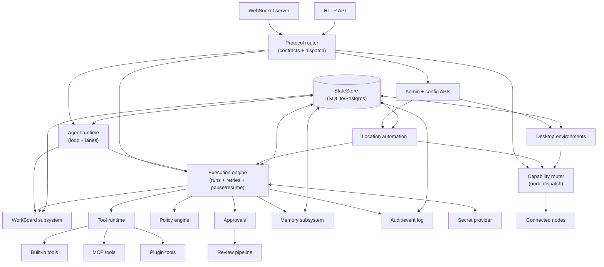

# Gateway

The gateway is Tyrum's long-lived control plane. It owns connectivity, routing, policy enforcement, approvals, execution coordination, and durable state integration for the rest of the system.

Deployments range from a single host to multi-instance clusters. The gateway keeps the same core control-plane role across both shapes and coordinates execution and event delivery through the StateStore and backplane. See [Scaling and High Availability](/architecture/scaling-ha).

## Mission

The gateway exists so Tyrum has one authoritative runtime boundary for interactive control, validation, and durable orchestration. It keeps clients, nodes, tools, models, and execution flows under a single typed and policy-aware control plane.

## Responsibilities

- Maintain long-lived connections to clients, nodes, channels, and model providers.
- Expose typed APIs and route requests to the correct runtime subsystem.
- Enforce contracts, auth/authz, approvals, reviews, and policy checks at trusted boundaries.
- Coordinate durable execution, event delivery, and persistence through the StateStore and backplane.
- Manage gateway-owned control-plane features such as desktop environments, location-aware automation, and configuration/state inspection APIs.
- Host the extension surfaces for tools, plugins, skills, and MCP integrations.

## Non-responsibilities

- The gateway does not perform device-specific automation directly; nodes provide that capability boundary.
- The gateway does not require a specific operator UI; multiple clients can connect concurrently.

## Boundary and ownership

- **Inside the boundary:** transport handling, validation, routing, execution coordination, approvals, policy enforcement, and durable state integration.
- **Outside the boundary:** client UX implementation, node-local execution details, and raw secret storage.

## Internal building blocks

- **Protocol and transport handling:** WebSocket connectivity, HTTP resource surfaces, and message validation.
- **Execution and safety controls:** execution engine, approvals, reviews, policy, automation, and audit/event emission.
- **Managed runtime surfaces:** node pairing/orchestration, gateway-managed desktop environments, and location-aware automation control APIs.
- **Extension surface:** tools, plugins, skills, MCP, and provider integrations.
- **Persistence and coordination:** StateStore integration, artifact references, event backplane, durable execution state, and configuration/state inventories.

## Internal topology

## Interfaces, inputs, outputs, and dependencies

- **Inputs:** client requests, node capability advertisements, location beacons, automation triggers, model/tool invocations, and external callbacks.
- **Outputs:** typed responses, server-push events, approval/review requests, durable execution state, and routed capability/tool calls.
- **Dependencies:** protocol/contracts, execution engine, StateStore, artifacts, secret provider, backplane, nodes, and providers.

Key interfaces:

- **Client interface:** WebSocket requests/responses plus server-push events.
- **Node interface:** WebSocket with pairing, capability advertisement, and capability RPC.
- **Extensions:** tool schemas, plugin registration, and optional MCP servers.
- **Execution and approvals:** requests/events for starting runs, streaming progress, pausing for approval, and resuming with resume tokens.
- **Managed runtime control:** admin/config routes for desktop environments, location-aware automation, routing, and other durable runtime configuration.

## Invariants and constraints

- All trusted boundaries are validated and deny-by-default.
- Durable state and event coordination must survive restarts and scale changes.
- Operator clients never execute node capability RPC directly; the gateway mediates that dispatch.
- Managed or embedded node forms still become ordinary paired nodes before capability dispatch is allowed.

## Failure and recovery

- **Failure modes:** connection churn, provider outages, worker failures, transient database errors, review timeouts, managed-runtime host failures, and approval pauses.
- **Recovery model:** reconnectable protocol sessions, durable state, resumable execution, review fallback, and backplane-driven event replay keep the control plane recoverable.

## Security and policy boundaries

- All inbound and outbound behavior is validated against contracts and policy.
- Risky actions pause behind approvals instead of relying on model self-restraint.
- Secrets remain behind a secret provider boundary and are resolved only in trusted execution contexts.

## Key decisions and tradeoffs

- **One long-lived control plane:** Tyrum centralizes validation, policy, and execution coordination instead of spreading them across many ad hoc services.
- **Policy, approvals, and reviews as first-class architecture:** risky behavior is governed by explicit runtime controls rather than prompt guidance alone.
- **Extensible core with hard boundaries:** tools, plugins, skills, and nodes can extend behavior without weakening the gateway's ownership of validation and routing.

## Implementation map

The current implementation is organized by gateway modules rather than by a separate service per box in the diagrams:

- **Edge and API surface:** `routes`, `ws`, `modules/auth`, `modules/authz`, `modules/ingress`
- **Execution and work coordination:** `modules/execution`, `modules/approval`, `modules/review`, `modules/workboard`, `modules/playbook`, `modules/watcher`, `modules/automation`, `modules/location`
- **Durability and runtime state:** `modules/statestore`, `modules/artifact`, `modules/backplane`, `modules/presence`, `modules/runtime-state`
- **Agent/runtime support:** `modules/agent`, `modules/memory`, `modules/context`, `modules/planner`
- **Device and node orchestration:** `modules/node`, `modules/desktop`, `modules/mobile`, `modules/desktop-environments`

## Integration map

External integrations are grouped into gateway modules as well:

- **Models and provider auth:** `modules/models`, `routes/provider-config.ts`, `routes/auth-profiles.ts`, `routes/provider-oauth.ts`
- **Tools, plugins, and extensions:** `modules/plugins`, `modules/extensions`, `routes/tool-registry.ts`, `routes/extensions.ts`
- **Secrets and policy:** `modules/secret`, `modules/policy`, `routes/secret.ts`, `routes/policy.ts`, `routes/policy-bundle.ts`
- **Channels and external ingress:** `modules/channels`, `routes/ingress.ts`, `routes/routing-config.ts`
- **Managed runtimes and contextual automation:** `modules/desktop-environments`, `modules/location`, `routes/desktop-environments.ts`, `routes/location.ts`, `routes/automation-triggers.ts`

## Drill-down

- [Architecture](/architecture)
- [API surfaces (WebSocket vs HTTP)](/architecture/api-surfaces)
- [Execution engine](/architecture/execution-engine)
- [Approvals](/architecture/approvals)
- [Reviews](/architecture/gateway/reviews)
- [Policy overrides (approve-always)](/architecture/policy-overrides)
- [Secrets](/architecture/secrets)
- [Provider Auth and Onboarding](/architecture/auth)
- [Artifacts](/architecture/artifacts)
- [Automation](/architecture/automation)
- [Desktop Environments](/architecture/gateway/desktop-environments)
- [Location Automation](/architecture/gateway/location-automation)
- [Tools](/architecture/tools)
- [Gateway plugins](/architecture/plugins)
- [Sandbox and Policy](/architecture/sandbox-policy)
- [Observability (Context, Usage, and Audit)](/architecture/observability)
