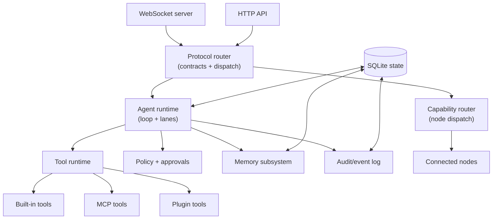

# Gateway

Status:

The gateway is Tyrum's single long-lived daemon. It is the system's authority for connectivity, policy, validation, routing, orchestration, and persistence.

## Responsibilities

- Maintain long-lived connections to clients, nodes, channels, and model providers.
- Expose typed APIs (WebSocket-first; HTTP where appropriate).
- Validate inbound/outbound messages against contracts.
- Route requests to internal modules or to capable nodes.
- Emit events for lifecycle, actions, and state changes.
- Persist essential state (sessions, transcripts, memory, audit logs).
- Host automation triggers (hooks, cron, heartbeat) in a controlled way.
- Provide a stable extension surface (tools, plugins, skills, MCP).

## Non-responsibilities

- The gateway should not perform device-specific automation directly. Device and UI automation live behind node capabilities.
- The gateway should not require a specific client UI; multiple clients can exist concurrently.

## Internal topology (conceptual)

## Key interfaces

- **Client interface:** WebSocket requests/responses + server-push events.
- **Node interface:** WebSocket with pairing, capability advertisement, and capability RPC.
- **Extensions:** tool schemas, plugin registration, and (optionally) MCP servers.
