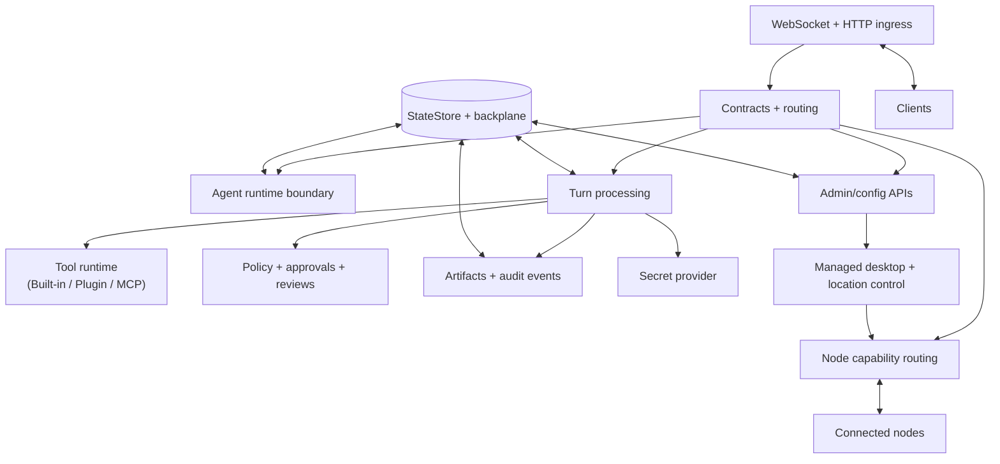

# Gateway

`@tyrum/gateway` is Tyrum's public runtime entrypoint and composition root. It owns bootstrap, transport adapters, dependency wiring across runtime packages, durable turn coordination, and bundled operator asset serving at the trusted control-plane boundary.

## Read this page

- **Read this if:** you need the top-level gateway boundary and flow model.
- **Skip this if:** you are implementing one subsystem and already know the control-plane shape.
- **Go deeper:** use the linked component pages for approvals, policy details, automation, and turn-processing mechanics.

## Control-plane topology

## Gateway boundary

### What the gateway owns

- CLI/bootstrap entrypoints, runtime startup, shutdown, and cross-package dependency wiring.
- Long-lived client and node connectivity through HTTP and WebSocket transport adapters.
- Contract validation, auth/authz enforcement, and translation between transport envelopes and runtime package calls.
- Durable coordination of conversations and turns, including queueing, approvals, and recovery.
- Bundled operator asset serving for `/ui` and other gateway-hosted runtime surfaces.
- Control-plane administration for managed runtime features such as desktop environments and location automation.

### What the gateway does not own

- Agent, memory, or WorkBoard business logic that belongs in focused runtime packages.
- DAL-heavy orchestration inside route handlers or WebSocket handlers beyond auth, parsing, and translation.
- Client UX rendering and host-specific presentation logic.
- Node-local device execution internals.
- Secret storage plaintext handling outside trusted providers.

## Primary flows

### Interactive control flow

1. A client request enters through typed transport and is validated at the gateway boundary.
2. The gateway authenticates, authorizes, and translates the request onto the appropriate conversation or runtime boundary.
3. The gateway schedules or resumes the next turn, persists resulting state transitions, and streams progress back through transport adapters.

### Durable coordination flow

1. Work, automation, approvals, or callbacks target a conversation.
2. The gateway coordinates turns, tools, nodes, approvals, and evidence with durable state behind each transition.
3. Outcomes are recorded and made observable through gateway-served events, audit surfaces, and operator state.

## Invariants for this boundary

- Trusted inputs are validated and deny-by-default.
- `@tyrum/gateway` remains the public runtime entrypoint and composition root, not the home for new business logic.
- `packages/gateway/src/routes/**` and `packages/gateway/src/ws/**` reach internal business logic through `packages/gateway/src/app/**` seams instead of importing `packages/gateway/src/modules/**` directly.
- Policy and approvals remain runtime controls, not prompt-only conventions.
- Node capability execution is always gateway-mediated.
- Durable state is authoritative for recovery across reconnects and scale changes.

## Go deeper

- [Architecture](/architecture)
- [API surfaces (WebSocket vs HTTP)](/architecture/api-surfaces)
- [Turn Processing and Durable Coordination](/architecture/turn-processing)
- [Approvals](/architecture/approvals)
- [Reviews](/architecture/gateway/reviews)
- [Policy overrides (approve-always)](/architecture/policy-overrides)
- [Sandbox and Policy](/architecture/sandbox-policy)
- [Secrets](/architecture/secrets)
- [Artifacts](/architecture/artifacts)
- [Tools](/architecture/tools)
- [Gateway plugins](/architecture/plugins)
- [Automation](/architecture/automation)
- [Desktop Environments](/architecture/gateway/desktop-environments)
- [Location Automation](/architecture/gateway/location-automation)
- [Observability (Context, Usage, and Audit)](/architecture/observability)
