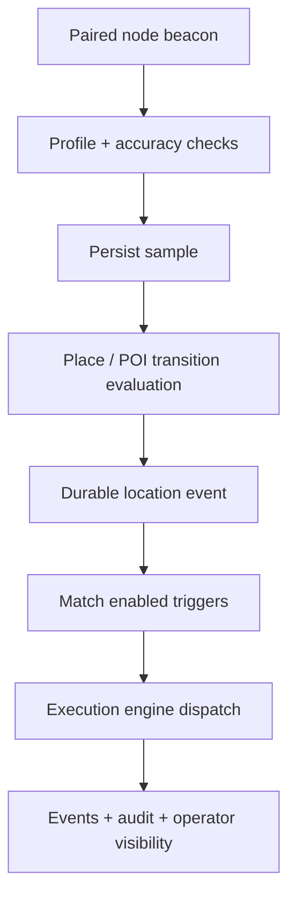

# Location automation

Read this if: you need the architectural path from location beacons to durable automation runs.

Skip this if: you only need generic automation triggers such as cron, heartbeat, or webhook.

Go deeper: [Automation](/architecture/automation), [Node](/architecture/node), [Events](/architecture/protocol/events).

## Beacon to run flow

## Purpose

Location automation turns node-reported location beacons into durable place or category events, then dispatches matching triggers through the same execution path used by other automation. Nodes sense; the gateway decides what the data means and whether it should cause work.

## What this boundary owns

- Location profiles, saved places, subject state, event history, and trigger definitions.
- Validation and acceptance of paired-node location samples.
- Enter/exit/dwell evaluation for saved places and optional POI categories.
- Dispatch into `agent_turn`, `steps`, or `playbook` execution modes.

It does not own device permissions, background sensing UX, or the generic scheduling model.

## Main flow

1. Operators define a profile, saved places, and automation triggers.
2. A paired node submits a beacon with coordinates and source metadata.
3. The gateway validates and persists the sample, then evaluates place or category transitions.
4. New transitions become durable location events, update subject state, and can emit downstream automation work.

## Invariants

- Triggering is driven from durable events, not transient in-memory geofence state.
- Rejected samples may be retained for audit/debug but must not trigger automation.
- Trigger execution still passes through the standard policy, approval, and audit boundaries.
- Location data remains a high-sensitivity surface and should be treated accordingly.

## Failure and recovery

- **Common failures:** bad beacon payloads, rejected samples, POI provider failures, trigger dispatch failure.
- **Recovery posture:** sample history and event history remain durable; saved-place evaluation can continue even when POI enrichment or downstream dispatch is degraded.

## Related docs

- [Automation](/architecture/automation)
- [Node](/architecture/node)
- [Gateway data model map](/architecture/data-model-map)
- [Data lifecycle and retention](/architecture/data-lifecycle)
