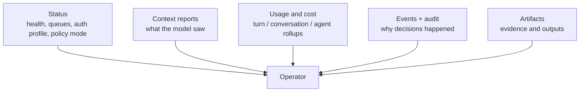

# Observability (context, usage, and audit)

Observability in Tyrum is about operator answers, not just telemetry volume. The gateway should make it easy to answer four questions: what is happening, what did the model see, why was an action allowed, and what did it cost.

## Quick orientation

- Read this if: you need the operator-facing inspection surfaces and the architecture behind them.
- Skip this if: you only need metric names or tracing exporter details.
- Go deeper: [Artifacts](/architecture/artifacts), [Provider auth and onboarding](/architecture/auth), [Protocol events](/architecture/protocol/events).

## What operators inspect

These surfaces are complementary. None of them alone is enough.

## The main inspection surfaces

### Status

Status surfaces answer "what is happening now?" They should expose current routing, queue depth, turn posture, policy mode, sandbox posture, and auth-profile health.

### Context inspection

Context reports answer "what did the model actually see?" They should show prompt sections, workspace injections, tool-schema overhead, and other durable inputs that shaped the turn.

### Usage and cost

Usage surfaces answer "what did this cost?" Tyrum keeps local accounting for budgets and approvals, then optionally layers provider-reported usage on top for operator guidance.

### Events, logs, and artifacts

These answer "why did this happen?" They link decisions, approvals, retries, overrides, artifacts, and provider-routing changes through stable ids so operators can correlate state across UI, storage, and exported bundles.

## Why this matters architecturally

Tyrum does not rely on ephemeral model memory for postmortems. The gateway persists the important context needed to inspect:

- decision history
- policy and approval lineage
- evidence produced by execution
- usage attribution at turn, conversation, and agent scope

That is what makes after-the-fact reasoning possible when a turn blocks, escalates, or fails.

## Hard invariants

- Operator inspection should be based on durable records, not best-effort console logs.
- Usage and provider quota polling are advisory surfaces, not silent billing truth replacements.
- Context inspection must help explain behavior without leaking raw secrets.
- Audit identifiers should be stable enough to correlate a single action across turns, approvals, overrides, and artifacts.

## Related docs

- [Artifacts](/architecture/artifacts)
- [Provider auth and onboarding](/architecture/auth)
- [Protocol events](/architecture/protocol/events)
- [Data lifecycle and retention](/architecture/data-lifecycle)
